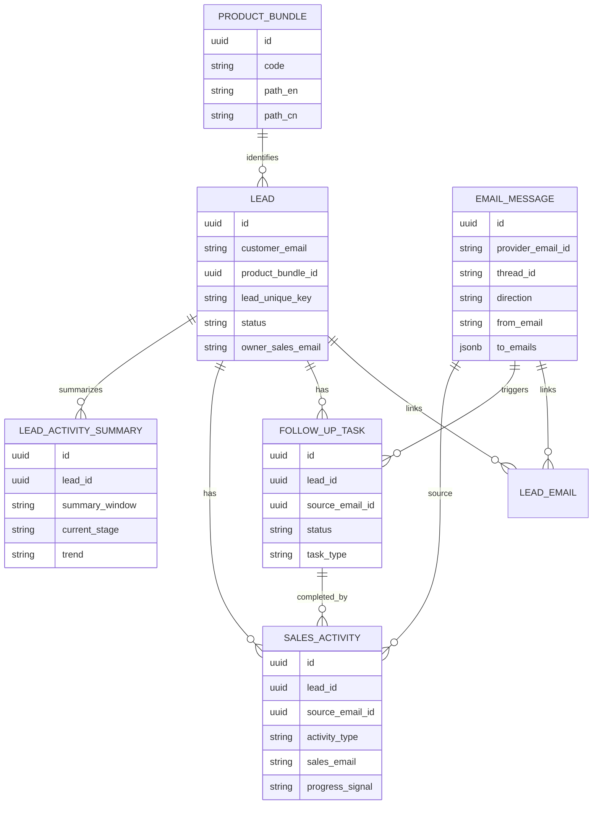

# Leads Agent 后端存储服务设计

## 1. 设计目标

本文档设计 Leads Agent 后端存储服务，技术栈：

- Database：PostgreSQL
- Backend：Java 17+
- Framework：Spring Boot
- ORM：Spring Data JPA / Hibernate
- Build：Maven

业务目标：

- 存储 Lead 线索、邮件、Follow-up Task、Activity。
- 支持 Agent 基于客户邮件创建或更新 Lead。
- 支持 `客户邮箱 + 商品组合` 作为 Lead 唯一判定标准。
- 支持客户邮件触发 Follow-up Task。
- 支持销售已发送邮件生成 Activity，并记录到 Lead timeline 下用于销售跟进考核。
- 支持 Agent 对 Activity 生成摘要、推进信号，并基于一段时间内的 Activity 生成 Lead timeline 汇总，供销售快速判断当前阶段和趋势。

核心定义：

- `Follow-up Task`：客户给 sales 发邮件后，Agent 识别邮件内容，自动生成给 sales 的提醒任务，提示 sales 去跟进。
- `Activity`：sales 针对某个 lead 已经发生的跟进行为记录，由 Agent 读取销售已发送邮件后自动创建，记录到 lead timeline 下，用于销售跟进考核。
- `Activity Summary`：Agent 对单条 Activity 的 AI 理解结果，包含简短摘要、关键点、是否推动销售进展、下一步信号等展示字段。
- `Lead Activity Timeline Summary`：Agent 基于最近 14/30 天 Activity 汇总出的 Lead 级跟进概览，包含整体摘要、当前阶段、互动趋势和客户意向。

## 2. 领域模型



## 3. Lead 唯一性规则

Lead 唯一键：

```text
lead_unique_key = lower(customer_email) + " + " + product_bundle.path_en
```

数据库层约束：

```sql
unique (customer_email_normalized, product_bundle_id)
```

示例：

```text
customer_email = gs_customer_01@163.com
product_bundle = RSBU > Protein > Protein Expression E.coli
lead_unique_key = gs_customer_01@163.com + RSBU > Protein > Protein Expression E.coli
```

判断逻辑：

| 场景 | 结果 |
| --- | --- |
| 同一客户邮箱继续补充同一商品组合信息 | 更新已有 Lead |
| 同一客户邮箱咨询另一个商品组合 | 创建新 Lead |
| 不同客户邮箱咨询同一商品组合 | 创建新 Lead |

## 4. PostgreSQL 表结构

### 4.1 product_bundle

商品组合表，用于标准化商品类目识别。

```sql
create table product_bundle (
    id uuid primary key,
    code varchar(128) not null unique,
    path_en varchar(512) not null,
    path_cn varchar(512) not null,
    business_unit varchar(64) not null,
    category_level1 varchar(128),
    category_level2 varchar(128),
    category_level3 varchar(128),
    synonyms jsonb not null default '[]'::jsonb,
    active boolean not null default true,
    created_at timestamptz not null default now(),
    updated_at timestamptz not null default now()
);

create index idx_product_bundle_path_en on product_bundle(path_en);
create index idx_product_bundle_synonyms_gin on product_bundle using gin (synonyms);
```

示例数据：

```sql
insert into product_bundle (
    id, code, path_en, path_cn, business_unit,
    category_level1, category_level2, category_level3, synonyms
) values (
    gen_random_uuid(),
    'RSBU_PROTEIN_ECOLI_EXPRESSION',
    'RSBU > Protein > Protein Expression E.coli',
    'RSBU > 蛋白 > 大肠杆菌蛋白表达组合',
    'RSBU',
    'Protein',
    'Protein Expression E.coli',
    null,
    '["大肠杆菌蛋白表达", "E.coli protein expression", "E.coli expression package", "E.coli HTP expression", "大肠杆菌表达纯化", "E.coli recombinant protein"]'
);
```

### 4.2 lead

Lead 主表。

```sql
create table lead (
    id uuid primary key,
    lead_no varchar(64) not null unique,
    customer_email varchar(320) not null,
    customer_email_normalized varchar(320) not null,
    customer_name varchar(256),
    company varchar(256),
    title varchar(256),
    phone varchar(64),

    product_bundle_id uuid not null references product_bundle(id),
    lead_unique_key varchar(1024) not null,

    owner_sales_email varchar(320) not null,
    status varchar(64) not null,
    intent_level varchar(32),
    current_stage varchar(64),
    timeline_trend varchar(64),
    latest_timeline_summary_id uuid,
    source varchar(64) not null default 'EMAIL',
    inquiry_summary text,
    extracted_requirements jsonb not null default '{}'::jsonb,

    first_email_id uuid,
    latest_email_at timestamptz,
    last_customer_email_at timestamptz,
    last_sales_activity_at timestamptz,

    created_by varchar(64) not null default 'LEADS_AGENT',
    created_at timestamptz not null default now(),
    updated_at timestamptz not null default now(),
    version bigint not null default 0,

    constraint uk_lead_customer_product unique (customer_email_normalized, product_bundle_id)
);

create index idx_lead_owner_status on lead(owner_sales_email, status);
create index idx_lead_owner_stage_trend on lead(owner_sales_email, current_stage, timeline_trend);
create index idx_lead_customer_email on lead(customer_email_normalized);
create index idx_lead_product_bundle on lead(product_bundle_id);
create index idx_lead_latest_email_at on lead(latest_email_at desc);
create index idx_lead_requirements_gin on lead using gin (extracted_requirements);
```

推荐状态枚举：

```text
NEW
CONTACTED
DISCOVERY
QUALIFIED
FOLLOW_UP_PENDING
READY_FOR_SALES_REVIEW
NURTURE
DISQUALIFIED
```

### 4.3 email_message

邮件原始消息表。客户邮件和销售邮件都进入此表。

```sql
create table email_message (
    id uuid primary key,
    provider_email_id varchar(256) not null,
    mailbox varchar(320) not null,
    thread_id varchar(256),
    direction varchar(32) not null,

    from_email varchar(320) not null,
    from_name varchar(256),
    to_emails jsonb not null default '[]'::jsonb,
    cc_emails jsonb not null default '[]'::jsonb,

    subject text,
    body_text text,
    body_html_ref text,
    snippet text,
    attachment_refs jsonb not null default '[]'::jsonb,

    sent_at timestamptz,
    received_at timestamptz,
    processed_at timestamptz,
    email_status varchar(64),

    raw_storage_ref text,
    created_at timestamptz not null default now(),

    constraint uk_email_provider unique (provider_email_id)
);

create index idx_email_thread on email_message(thread_id);
create index idx_email_direction_time on email_message(direction, coalesce(received_at, sent_at));
create index idx_email_from on email_message(from_email);
create index idx_email_to_gin on email_message using gin (to_emails);
```

方向枚举：

```text
INBOUND_CUSTOMER
OUTBOUND_SALES
INTERNAL
UNKNOWN
```

### 4.4 lead_email

Lead 与邮件关联表。保留多对多能力，因为一封客户邮件理论上可能同时咨询多个商品组合。

```sql
create table lead_email (
    id uuid primary key,
    lead_id uuid not null references lead(id) on delete cascade,
    email_message_id uuid not null references email_message(id) on delete cascade,
    relation_type varchar(64) not null,
    match_confidence numeric(5,4),
    match_reason text,
    created_at timestamptz not null default now(),

    constraint uk_lead_email unique (lead_id, email_message_id)
);

create index idx_lead_email_lead on lead_email(lead_id);
create index idx_lead_email_message on lead_email(email_message_id);
```

relation_type：

```text
FIRST_INQUIRY
CUSTOMER_CONTEXT
SALES_REPLY
RELATED_EMAIL
```

### 4.5 follow_up_task

Follow-up Task 表。由客户邮件触发，用于提醒销售下一步跟进。

```sql
create table follow_up_task (
    id uuid primary key,
    task_no varchar(64) not null unique,
    lead_id uuid not null references lead(id) on delete cascade,
    source_email_id uuid references email_message(id),

    assigned_sales_email varchar(320) not null,
    status varchar(64) not null,
    task_type varchar(64) not null,
    priority varchar(32) not null default 'NORMAL',

    title varchar(512) not null,
    summary text,
    reason text,
    suggested_action text,
    display_summary varchar(512),
    customer_need_summary text,
    source_event_summary text,
    action_items jsonb not null default '[]'::jsonb,
    context_snapshot jsonb not null default '{}'::jsonb,
    priority_reason text,
    due_at timestamptz,

    accepted_at timestamptz,
    completed_at timestamptz,
    dismissed_at timestamptz,
    close_reason text,

    created_by varchar(64) not null default 'LEADS_AGENT',
    created_at timestamptz not null default now(),
    updated_at timestamptz not null default now(),
    version bigint not null default 0
);

create index idx_task_sales_status_due on follow_up_task(assigned_sales_email, status, due_at);
create index idx_task_lead on follow_up_task(lead_id);
create index idx_task_source_email on follow_up_task(source_email_id);
```

status：

```text
PROPOSED
ACCEPTED
DONE
DISMISSED
EXPIRED
```

task_type：

```text
REPLY_EMAIL
CLARIFY_REQUIREMENTS
SEND_INFORMATION
SCHEDULE_MEETING
CHECK_STATUS
PREPARE_SALES_REVIEW
```

展示字段说明：

| 字段 | 用途 |
| --- | --- |
| display_summary | Task 列表页的一句话摘要，建议控制在 100 字以内。 |
| customer_need_summary | 客户当前需求、问题或催促点，用于详情页展示。 |
| source_event_summary | 触发该任务的客户邮件、上一条 activity 或 timeline summary 摘要。 |
| action_items | 可执行动作列表，例如索取序列、发送报价、安排会议。 |
| context_snapshot | 创建任务时的 lead 摘要快照，避免后续 lead 内容变化导致历史任务语义丢失。 |
| priority_reason | Agent 判定优先级的原因，例如 high intent、客户催促、报价请求。 |

### 4.6 sales_activity

Activity 表。只记录销售已发生的跟进行为，用于 timeline 和考核。

```sql
create table sales_activity (
    id uuid primary key,
    activity_no varchar(64) not null unique,
    lead_id uuid not null references lead(id) on delete cascade,
    source_email_id uuid references email_message(id),
    related_task_id uuid references follow_up_task(id),

    sales_email varchar(320) not null,
    activity_type varchar(64) not null,
    occurred_at timestamptz not null,

    title varchar(512),
    summary text not null,
    key_points jsonb not null default '[]'::jsonb,
    customer_signals jsonb not null default '[]'::jsonb,
    next_step_signals jsonb not null default '[]'::jsonb,
    progress_signal varchar(32) not null default 'UNKNOWN',
    progress_reason text,
    stage_after_activity varchar(64),
    extracted_payload jsonb not null default '{}'::jsonb,
    confidence numeric(5,4),

    created_by varchar(64) not null default 'LEADS_AGENT',
    created_at timestamptz not null default now(),
    updated_at timestamptz not null default now()
);

create index idx_activity_lead_time on sales_activity(lead_id, occurred_at desc);
create index idx_activity_sales_time on sales_activity(sales_email, occurred_at desc);
create index idx_activity_progress on sales_activity(lead_id, progress_signal, occurred_at desc);
create index idx_activity_source_email on sales_activity(source_email_id);
create index idx_activity_payload_gin on sales_activity using gin (extracted_payload);
```

activity_type：

```text
EMAIL_SENT
CALL
MEETING
NOTE
```

progress_signal：

```text
PROGRESS
NO_PROGRESS
UNKNOWN
```

Activity 展示规则：

- `summary` 是 timeline 上直接展示的 Activity Summary，建议控制在 100 字以内，避免用户反复打开邮件原文。
- `key_points` 记录结构化要点，例如报价、资料、约定时间、客户疑问、技术要求。
- `customer_signals` 记录客户意向信号，例如询价、确认项目、表示感兴趣、要求下一步。
- `next_step_signals` 记录下一步动作信号，例如安排会议、发送 protocol、补充报价、等待客户确认。
- `progress_signal=PROGRESS` 表示该 activity 中出现明确需求、明确下一步动作或明确推进意愿。
- `progress_signal=NO_PROGRESS` 表示内容为寒暄、泛泛沟通、无具体行动或无明确需求。
- `stage_after_activity` 是 Agent 基于该 activity 对 Lead 阶段的单条判断，可用于生成 lead 级 summary。

重要约束：

- 客户 inbound 邮件不创建 `sales_activity`。
- 只有销售 outbound 邮件、销售电话、销售会议、销售备注等动作才创建 `sales_activity`。
- `sales_activity.occurred_at` 使用销售行为真实发生时间，例如邮件 sent_at。

### 4.7 lead_activity_summary

Lead Activity Timeline Summary 表。保存 Agent 基于一段时间内 Activity 生成的 Lead 级汇总结果，用于详情页顶部摘要、列表筛选和销售看板。

```sql
create table lead_activity_summary (
    id uuid primary key,
    lead_id uuid not null references lead(id) on delete cascade,
    summary_window varchar(32) not null,
    window_start_at timestamptz not null,
    window_end_at timestamptz not null,

    overall_summary text not null,
    customer_intent varchar(64) not null default 'UNCLEAR',
    current_stage varchar(64) not null,
    trend varchar(64) not null,
    trend_reason text,

    progress_activity_count integer not null default 0,
    no_progress_activity_count integer not null default 0,
    last_progress_at timestamptz,
    last_activity_at timestamptz,
    next_recommended_action text,

    source_activity_ids jsonb not null default '[]'::jsonb,
    confidence numeric(5,4),
    generated_by varchar(64) not null default 'LEADS_AGENT',
    generated_at timestamptz not null default now(),

    constraint uk_lead_activity_summary_window unique (lead_id, summary_window, window_end_at)
);

create index idx_lead_activity_summary_lead_time on lead_activity_summary(lead_id, generated_at desc);
create index idx_lead_activity_summary_stage_trend on lead_activity_summary(current_stage, trend);
```

summary_window：

```text
LAST_14_DAYS
LAST_30_DAYS
ALL_TIME
```

customer_intent：

```text
YES
NO
UNCLEAR
```

current_stage：

```text
NEW
ENGAGED
STALLED
INACTIVE
```

trend：

```text
IMPROVING
STABLE
DECLINING
```

阶段与趋势判断：

| 字段 | 含义 |
| --- | --- |
| current_stage=NEW | 刚创建，尚无有效互动。 |
| current_stage=ENGAGED | 有明确互动或推进信号。 |
| current_stage=STALLED | 曾经推进，但近期无新的进展。 |
| current_stage=INACTIVE | 长时间无互动。 |
| trend=IMPROVING | 最近出现推进信号，例如报价请求、会议安排、确认下一步。 |
| trend=STABLE | 近期互动无明显变化。 |
| trend=DECLINING | 从有进展转为停滞，或持续无明确下一步。 |

### 4.8 agent_processing_log

Agent 处理日志，用于幂等、排错和审计。

```sql
create table agent_processing_log (
    id uuid primary key,
    source_type varchar(64) not null,
    source_id varchar(256) not null,
    action varchar(128) not null,
    status varchar(64) not null,
    request_payload jsonb,
    result_payload jsonb,
    error_message text,
    started_at timestamptz not null default now(),
    finished_at timestamptz,

    constraint uk_agent_processing unique (source_type, source_id, action)
);

create index idx_agent_log_status on agent_processing_log(status, started_at desc);
```

## 5. JPA Entity 设计

### 5.1 Maven 依赖

```xml
<dependencies>
    <dependency>
        <groupId>org.springframework.boot</groupId>
        <artifactId>spring-boot-starter-web</artifactId>
    </dependency>
    <dependency>
        <groupId>org.springframework.boot</groupId>
        <artifactId>spring-boot-starter-data-jpa</artifactId>
    </dependency>
    <dependency>
        <groupId>org.postgresql</groupId>
        <artifactId>postgresql</artifactId>
        <scope>runtime</scope>
    </dependency>
    <dependency>
        <groupId>org.flywaydb</groupId>
        <artifactId>flyway-core</artifactId>
    </dependency>
    <dependency>
        <groupId>org.flywaydb</groupId>
        <artifactId>flyway-database-postgresql</artifactId>
    </dependency>
    <dependency>
        <groupId>org.projectlombok</groupId>
        <artifactId>lombok</artifactId>
        <optional>true</optional>
    </dependency>
</dependencies>
```

如需更好支持 PostgreSQL `jsonb`，建议使用 Hibernate 6 的 `@JdbcTypeCode(SqlTypes.JSON)`。

### 5.2 Entity 列表

建议包结构：

```text
com.genscript.leads
├── controller
├── service
├── repository
├── domain
├── dto
└── enums
```

核心 Entity：

| Entity | Table | 说明 |
| --- | --- | --- |
| ProductBundleEntity | product_bundle | 商品组合标准表 |
| LeadEntity | lead | Lead 主表 |
| EmailMessageEntity | email_message | 邮件消息表 |
| LeadEmailEntity | lead_email | Lead 与邮件关联 |
| FollowUpTaskEntity | follow_up_task | 销售跟进提醒任务 |
| SalesActivityEntity | sales_activity | 销售已发生跟进行为 |
| LeadActivitySummaryEntity | lead_activity_summary | Lead 级 timeline 汇总 |
| AgentProcessingLogEntity | agent_processing_log | Agent 处理日志 |

### 5.3 关键枚举

```java
public enum LeadStatus {
    NEW,
    CONTACTED,
    DISCOVERY,
    QUALIFIED,
    FOLLOW_UP_PENDING,
    READY_FOR_SALES_REVIEW,
    NURTURE,
    DISQUALIFIED
}

public enum EmailDirection {
    INBOUND_CUSTOMER,
    OUTBOUND_SALES,
    INTERNAL,
    UNKNOWN
}

public enum FollowUpTaskStatus {
    PROPOSED,
    ACCEPTED,
    DONE,
    DISMISSED,
    EXPIRED
}

public enum FollowUpTaskType {
    REPLY_EMAIL,
    CLARIFY_REQUIREMENTS,
    SEND_INFORMATION,
    SCHEDULE_MEETING,
    CHECK_STATUS,
    PREPARE_SALES_REVIEW
}

public enum SalesActivityType {
    EMAIL_SENT,
    CALL,
    MEETING,
    NOTE
}

public enum ActivityProgressSignal {
    PROGRESS,
    NO_PROGRESS,
    UNKNOWN
}

public enum LeadActivitySummaryWindow {
    LAST_14_DAYS,
    LAST_30_DAYS,
    ALL_TIME
}

public enum CustomerIntent {
    YES,
    NO,
    UNCLEAR
}

public enum LeadActivityStage {
    NEW,
    ENGAGED,
    STALLED,
    INACTIVE
}

public enum LeadActivityTrend {
    IMPROVING,
    STABLE,
    DECLINING
}
```

### 5.4 LeadEntity 示例

```java
@Entity
@Table(
    name = "lead",
    uniqueConstraints = {
        @UniqueConstraint(
            name = "uk_lead_customer_product",
            columnNames = {"customer_email_normalized", "product_bundle_id"}
        )
    }
)
public class LeadEntity {

    @Id
    private UUID id;

    @Column(nullable = false, unique = true, length = 64)
    private String leadNo;

    @Column(nullable = false, length = 320)
    private String customerEmail;

    @Column(nullable = false, length = 320)
    private String customerEmailNormalized;

    @ManyToOne(fetch = FetchType.LAZY, optional = false)
    @JoinColumn(name = "product_bundle_id")
    private ProductBundleEntity productBundle;

    @Column(nullable = false, length = 1024)
    private String leadUniqueKey;

    @Column(nullable = false, length = 320)
    private String ownerSalesEmail;

    @Enumerated(EnumType.STRING)
    @Column(nullable = false, length = 64)
    private LeadStatus status;

    @Enumerated(EnumType.STRING)
    @Column(length = 64)
    private LeadActivityStage currentStage;

    @Enumerated(EnumType.STRING)
    @Column(length = 64)
    private LeadActivityTrend timelineTrend;

    @ManyToOne(fetch = FetchType.LAZY)
    @JoinColumn(name = "latest_timeline_summary_id")
    private LeadActivitySummaryEntity latestTimelineSummary;

    @JdbcTypeCode(SqlTypes.JSON)
    @Column(columnDefinition = "jsonb", nullable = false)
    private Map<String, Object> extractedRequirements = new HashMap<>();

    @Version
    private Long version;

    private Instant createdAt;
    private Instant updatedAt;
}
```

### 5.5 SalesActivityEntity 示例

```java
@Entity
@Table(name = "sales_activity")
public class SalesActivityEntity {

    @Id
    private UUID id;

    @ManyToOne(fetch = FetchType.LAZY, optional = false)
    @JoinColumn(name = "lead_id")
    private LeadEntity lead;

    @ManyToOne(fetch = FetchType.LAZY)
    @JoinColumn(name = "source_email_id")
    private EmailMessageEntity sourceEmail;

    @ManyToOne(fetch = FetchType.LAZY)
    @JoinColumn(name = "related_task_id")
    private FollowUpTaskEntity relatedTask;

    @Column(nullable = false, length = 320)
    private String salesEmail;

    @Enumerated(EnumType.STRING)
    @Column(nullable = false, length = 64)
    private SalesActivityType activityType;

    @Column(nullable = false)
    private Instant occurredAt;

    @Column(length = 512)
    private String title;

    @Column(nullable = false, columnDefinition = "text")
    private String summary;

    @JdbcTypeCode(SqlTypes.JSON)
    @Column(columnDefinition = "jsonb", nullable = false)
    private List<String> keyPoints = new ArrayList<>();

    @JdbcTypeCode(SqlTypes.JSON)
    @Column(columnDefinition = "jsonb", nullable = false)
    private List<String> customerSignals = new ArrayList<>();

    @JdbcTypeCode(SqlTypes.JSON)
    @Column(columnDefinition = "jsonb", nullable = false)
    private List<String> nextStepSignals = new ArrayList<>();

    @Enumerated(EnumType.STRING)
    @Column(nullable = false, length = 32)
    private ActivityProgressSignal progressSignal = ActivityProgressSignal.UNKNOWN;

    @Column(columnDefinition = "text")
    private String progressReason;

    @Enumerated(EnumType.STRING)
    @Column(length = 64)
    private LeadActivityStage stageAfterActivity;
}
```

### 5.6 LeadActivitySummaryEntity 示例

```java
@Entity
@Table(name = "lead_activity_summary")
public class LeadActivitySummaryEntity {

    @Id
    private UUID id;

    @ManyToOne(fetch = FetchType.LAZY, optional = false)
    @JoinColumn(name = "lead_id")
    private LeadEntity lead;

    @Enumerated(EnumType.STRING)
    @Column(nullable = false, length = 32)
    private LeadActivitySummaryWindow summaryWindow;

    private Instant windowStartAt;
    private Instant windowEndAt;

    @Column(nullable = false, columnDefinition = "text")
    private String overallSummary;

    @Enumerated(EnumType.STRING)
    @Column(nullable = false, length = 64)
    private CustomerIntent customerIntent = CustomerIntent.UNCLEAR;

    @Enumerated(EnumType.STRING)
    @Column(nullable = false, length = 64)
    private LeadActivityStage currentStage;

    @Enumerated(EnumType.STRING)
    @Column(nullable = false, length = 64)
    private LeadActivityTrend trend;

    @Column(columnDefinition = "text")
    private String trendReason;

    private Integer progressActivityCount = 0;
    private Integer noProgressActivityCount = 0;
    private Instant lastProgressAt;
    private Instant lastActivityAt;

    @Column(columnDefinition = "text")
    private String nextRecommendedAction;
}
```

## 6. Repository 设计

```java
public interface LeadRepository extends JpaRepository<LeadEntity, UUID> {
    Optional<LeadEntity> findByCustomerEmailNormalizedAndProductBundleId(
        String customerEmailNormalized,
        UUID productBundleId
    );

    Page<LeadEntity> findByOwnerSalesEmailAndStatus(
        String ownerSalesEmail,
        LeadStatus status,
        Pageable pageable
    );
}

public interface EmailMessageRepository extends JpaRepository<EmailMessageEntity, UUID> {
    Optional<EmailMessageEntity> findByProviderEmailId(String providerEmailId);
    List<EmailMessageEntity> findByThreadIdOrderByCreatedAtAsc(String threadId);
}

public interface FollowUpTaskRepository extends JpaRepository<FollowUpTaskEntity, UUID> {
    Page<FollowUpTaskEntity> findByAssignedSalesEmailAndStatus(
        String assignedSalesEmail,
        FollowUpTaskStatus status,
        Pageable pageable
    );
}

public interface SalesActivityRepository extends JpaRepository<SalesActivityEntity, UUID> {
    List<SalesActivityEntity> findByLeadIdOrderByOccurredAtDesc(UUID leadId);
}

public interface LeadActivitySummaryRepository extends JpaRepository<LeadActivitySummaryEntity, UUID> {
    Optional<LeadActivitySummaryEntity> findFirstByLeadIdAndSummaryWindowOrderByGeneratedAtDesc(
        UUID leadId,
        LeadActivitySummaryWindow summaryWindow
    );
}
```

## 7. Service 设计

### 7.1 EmailIngestionService

处理客户 inbound 邮件。

职责：

- 保存 `email_message`。
- 根据 Agent 抽取结果识别 customer email 和 product bundle。
- 按 `customer_email + product_bundle_id` 查找或创建 lead。
- 关联 `lead_email`。
- 更新 lead 上下文。
- 创建 follow-up task。
- 不创建 sales activity。

核心方法：

```java
InboundEmailIngestResult ingestCustomerEmail(InboundEmailIngestRequest request);
```

### 7.2 SalesEmailActivityService

处理销售 outbound 邮件。

职责：

- 保存销售邮件。
- 匹配 lead。
- 创建 `sales_activity`。
- 保存 Activity Summary 展示字段，包括 `summary`、`key_points`、`progress_signal`、`stage_after_activity`。
- 根据 activity 关闭或推进 follow-up task。
- 更新 lead 的 `last_sales_activity_at`、状态、`current_stage` 和 `timeline_trend`。
- 触发或同步生成 `lead_activity_summary`。

核心方法：

```java
SalesActivityResponse ingestSalesEmail(SalesEmailIngestRequest request);
```

### 7.3 FollowUpTaskService

职责：

- 查询销售待办。
- 接受、完成、忽略任务。
- 过期任务处理。

核心方法：

```java
Page<FollowUpTaskResponse> listTasks(String salesEmail, FollowUpTaskStatus status, Pageable pageable);
FollowUpTaskResponse updateStatus(UUID taskId, UpdateTaskStatusRequest request);
```

### 7.4 LeadTimelineService

职责：

- 聚合 Lead 上下文、客户邮件记录、follow-up task、sales activity。
- timeline 展示时明确区分：
  - customer email context
  - follow-up task
  - sales activity

核心方法：

```java
LeadTimelineResponse getTimeline(UUID leadId);
```

### 7.5 LeadActivitySummaryService

职责：

- 基于最近 14/30 天或全量 Activity 生成 Lead 级 timeline summary。
- 统计 `PROGRESS` / `NO_PROGRESS` activity 数量。
- 判断 `customer_intent`、`current_stage`、`trend`，并写回 lead 的最新摘要字段。
- 给销售提供下一步推荐动作，但不直接代替销售执行。

核心方法：

```java
LeadActivitySummaryResponse regenerateSummary(UUID leadId, LeadActivitySummaryWindow window);
LeadActivitySummaryResponse getLatestSummary(UUID leadId, LeadActivitySummaryWindow window);
```

## 8. REST API 设计

### 8.1 客户邮件入站

```http
POST /api/agent/emails/inbound
```

用途：Agent 读取客户邮件后调用，创建或更新 lead，并生成 follow-up task。

Request：

```json
{
  "providerEmailId": "EMAIL-DANIEL-001",
  "threadId": "THREAD-DANIEL-ECOLI-PROTEIN-001",
  "mailbox": "gs_sales_01@163.com",
  "fromEmail": "gs_customer_01@163.com",
  "fromName": "Daniel Villarreal",
  "toEmails": ["gs_sales_01@163.com"],
  "subject": "大肠杆菌蛋白表达组合服务咨询",
  "bodyText": "我们正在评估一个重组蛋白项目...",
  "receivedAt": "2026-05-21T03:03:00Z",
  "agentExtraction": {
    "customerEmail": "gs_customer_01@163.com",
    "customerName": "Daniel Villarreal",
    "company": "Bionova Scientific, LLC",
    "productBundleCode": "RSBU_PROTEIN_ECOLI_EXPRESSION",
    "inquirySummary": "客户咨询 3 个候选蛋白的大肠杆菌表达组合服务",
    "intentLevel": "HIGH",
    "requirements": {
      "proteinCount": 3,
      "expressionSystem": "E.coli",
      "tag": "N-terminal His tag"
    },
    "suggestedTask": {
      "taskType": "CLARIFY_REQUIREMENTS",
      "title": "确认 E.coli 蛋白表达项目需求",
      "summary": "客户咨询 3 个候选蛋白的大肠杆菌表达组合服务，需要确认序列、标签、目标产量和纯化要求",
      "displaySummary": "确认序列、标签、目标产量和纯化要求",
      "customerNeedSummary": "客户正在评估 3 个候选蛋白的大肠杆菌表达服务，需要了解项目可行性、交付周期和报价前置要求",
      "sourceEventSummary": "客户首次来信咨询 E.coli 蛋白表达组合服务",
      "suggestedAction": "回复客户并索取序列、目标产量、buffer、QC 和周期要求",
      "actionItems": [
        "索取 3 个候选蛋白序列",
        "确认目标产量和纯化标签",
        "确认 buffer、QC 和交付周期要求"
      ],
      "priorityReason": "客户有明确项目背景和多个候选蛋白，意向较高",
      "dueAt": "2026-05-21T07:03:00Z"
    }
  }
}
```

Response：

```json
{
  "leadId": "uuid",
  "leadNo": "LD-20260521-0001",
  "leadUniqueKey": "gs_customer_01@163.com + RSBU > Protein > Protein Expression E.coli",
  "createdNewLead": true,
  "followUpTaskId": "uuid",
  "followUpTaskStatus": "PROPOSED"
}
```

### 8.2 销售邮件出站

```http
POST /api/agent/emails/outbound-sales
```

用途：Agent 读取销售已发送邮件后调用，创建 sales activity。

Request：

```json
{
  "providerEmailId": "EMAIL-DANIEL-004",
  "threadId": "THREAD-DANIEL-ECOLI-PROTEIN-001",
  "mailbox": "gs_sales_01@163.com",
  "fromEmail": "gs_sales_01@163.com",
  "toEmails": ["gs_customer_01@163.com"],
  "subject": "Re: 大肠杆菌蛋白表达组合服务咨询",
  "bodyText": "感谢你提供项目背景...",
  "sentAt": "2026-05-21T09:20:00Z",
  "agentExtraction": {
    "customerEmail": "gs_customer_01@163.com",
    "productBundleCode": "RSBU_PROTEIN_ECOLI_EXPRESSION",
    "activityType": "EMAIL_SENT",
    "title": "销售回复并澄清 E.coli 表达需求",
    "summary": "销售确认商品组合为 E.coli 蛋白表达，并澄清目标产量、buffer、tag removal 和替代表达系统需求",
    "keyPoints": [
      "确认商品组合：RSBU > Protein > Protein Expression E.coli",
      "询问每个蛋白目标产量",
      "询问 buffer、内毒素、tag removal 要求"
    ],
    "customerSignals": [
      "客户有明确蛋白表达项目",
      "客户需要进一步技术确认"
    ],
    "nextStepSignals": [
      "等待客户提供序列和目标产量",
      "收到需求后准备报价或技术方案"
    ],
    "progressSignal": "PROGRESS",
    "progressReason": "销售回复中明确提出了报价前需要客户补充的信息，沟通进入需求澄清阶段",
    "stageAfterActivity": "ENGAGED",
    "relatedTaskId": "uuid",
    "confidence": 0.98
  }
}
```

Response：

```json
{
  "leadId": "uuid",
  "activityId": "uuid",
  "activityType": "EMAIL_SENT",
  "progressSignal": "PROGRESS",
  "stageAfterActivity": "ENGAGED",
  "createdActivity": true,
  "closedTaskIds": ["uuid"],
  "updatedTimelineSummary": {
    "summaryWindow": "LAST_30_DAYS",
    "currentStage": "ENGAGED",
    "trend": "IMPROVING"
  }
}
```

### 8.3 查询 Lead

```http
GET /api/leads?ownerSalesEmail=gs_sales_01@163.com&status=DISCOVERY&page=0&size=20
```

Response：

```json
{
  "content": [
    {
      "leadId": "uuid",
      "leadNo": "LD-20260521-0001",
      "customerEmail": "gs_customer_01@163.com",
      "customerName": "Daniel Villarreal",
      "productBundle": {
        "code": "RSBU_PROTEIN_ECOLI_EXPRESSION",
        "pathEn": "RSBU > Protein > Protein Expression E.coli",
        "pathCn": "RSBU > 蛋白 > 大肠杆菌蛋白表达组合"
      },
      "leadUniqueKey": "gs_customer_01@163.com + RSBU > Protein > Protein Expression E.coli",
      "status": "DISCOVERY",
      "intentLevel": "HIGH",
      "inquirySummary": "客户咨询 3 个候选蛋白的大肠杆菌表达组合服务",
      "activitySummary": {
        "summaryWindow": "LAST_30_DAYS",
        "overallSummary": "客户已明确 E.coli 蛋白表达需求，销售已回复并索取序列、目标产量和纯化要求，当前等待客户补充技术信息。",
        "customerIntent": "YES",
        "currentStage": "ENGAGED",
        "trend": "IMPROVING",
        "nextRecommendedAction": "若 1 个工作日内客户未回复，提醒销售 follow up 并提供需求清单模板。"
      },
      "openTaskPreview": {
        "taskId": "uuid",
        "taskType": "CHECK_STATUS",
        "priority": "NORMAL",
        "displaySummary": "等待客户补充序列和目标产量",
        "dueAt": "2026-05-22T09:20:00Z"
      }
    }
  ],
  "totalElements": 1
}
```

### 8.4 查询 Lead Timeline

```http
GET /api/leads/{leadId}/timeline
```

Response：

```json
{
  "leadId": "uuid",
  "leadUniqueKey": "gs_customer_01@163.com + RSBU > Protein > Protein Expression E.coli",
  "activitySummary": {
    "summaryWindow": "LAST_30_DAYS",
    "overallSummary": "客户有明确 E.coli 蛋白表达项目需求，销售已完成首次回复并进入需求澄清阶段。",
    "customerIntent": "YES",
    "currentStage": "ENGAGED",
    "trend": "IMPROVING",
    "trendReason": "最近一条销售 activity 明确提出下一步信息收集动作，沟通从首次咨询推进到需求澄清。",
    "progressActivityCount": 1,
    "noProgressActivityCount": 0,
    "lastProgressAt": "2026-05-21T09:20:00Z",
    "nextRecommendedAction": "跟进客户补充序列、目标产量、buffer 和 QC 要求。"
  },
  "items": [
    {
      "type": "CUSTOMER_EMAIL_CONTEXT",
      "occurredAt": "2026-05-21T03:03:00Z",
      "summary": "客户主动咨询大肠杆菌蛋白表达组合服务",
      "display": {
        "title": "客户首次咨询",
        "subtitle": "Daniel Villarreal / Bionova Scientific, LLC",
        "body": "客户咨询 3 个候选蛋白的大肠杆菌表达组合服务。",
        "badges": ["HIGH_INTENT", "E.coli"]
      }
    },
    {
      "type": "FOLLOW_UP_TASK",
      "occurredAt": "2026-05-21T03:04:00Z",
      "summary": "提醒销售确认蛋白序列、标签、表达规模、纯化要求",
      "display": {
        "title": "确认 E.coli 蛋白表达项目需求",
        "status": "DONE",
        "priority": "HIGH",
        "body": "客户需要了解项目可行性、交付周期和报价前置要求。",
        "actionItems": [
          "索取 3 个候选蛋白序列",
          "确认目标产量和纯化标签",
          "确认 buffer、QC 和交付周期要求"
        ]
      }
    },
    {
      "type": "SALES_ACTIVITY",
      "occurredAt": "2026-05-21T09:20:00Z",
      "summary": "销售回复客户并澄清 E.coli 蛋白表达需求",
      "display": {
        "title": "销售回复并澄清需求",
        "activityType": "EMAIL_SENT",
        "progressSignal": "PROGRESS",
        "stageAfterActivity": "ENGAGED",
        "body": "销售确认商品组合为 E.coli 蛋白表达，并澄清目标产量、buffer、tag removal 和替代表达系统需求。",
        "keyPoints": [
          "确认商品组合",
          "询问目标产量",
          "询问 buffer 和 tag removal 要求"
        ],
        "nextStepSignals": [
          "等待客户提供序列和目标产量",
          "收到需求后准备报价或技术方案"
        ]
      }
    }
  ]
}
```

### 8.5 查询 Follow-up Task

```http
GET /api/follow-up-tasks?assignedSalesEmail=gs_sales_01@163.com&status=PROPOSED
```

Response：

```json
{
  "content": [
    {
      "taskId": "uuid",
      "taskNo": "TASK-20260521-0001",
      "leadId": "uuid",
      "leadNo": "LD-20260521-0001",
      "customerName": "Daniel Villarreal",
      "company": "Bionova Scientific, LLC",
      "productBundleName": "RSBU > Protein > Protein Expression E.coli",
      "taskType": "CLARIFY_REQUIREMENTS",
      "status": "PROPOSED",
      "priority": "HIGH",
      "title": "确认 E.coli 蛋白表达项目需求",
      "displaySummary": "确认序列、标签、目标产量和纯化要求",
      "customerNeedSummary": "客户正在评估 3 个候选蛋白的大肠杆菌表达服务，需要了解项目可行性、交付周期和报价前置要求。",
      "sourceEventSummary": "客户首次来信咨询 E.coli 蛋白表达组合服务。",
      "suggestedAction": "回复客户并索取序列、目标产量、buffer、QC 和周期要求。",
      "actionItems": [
        "索取 3 个候选蛋白序列",
        "确认目标产量和纯化标签",
        "确认 buffer、QC 和交付周期要求"
      ],
      "priorityReason": "客户有明确项目背景和多个候选蛋白，意向较高。",
      "dueAt": "2026-05-21T07:03:00Z",
      "createdAt": "2026-05-21T03:04:00Z"
    }
  ],
  "totalElements": 1
}
```

### 8.6 更新 Follow-up Task 状态

```http
PATCH /api/follow-up-tasks/{taskId}/status
```

Request：

```json
{
  "status": "DONE",
  "closeReason": "Sales replied by email"
}
```

### 8.7 查询 Sales Activity

```http
GET /api/leads/{leadId}/activities
```

Response：

```json
[
  {
    "activityId": "uuid",
    "activityType": "EMAIL_SENT",
    "title": "销售回复并澄清需求",
    "salesEmail": "gs_sales_01@163.com",
    "occurredAt": "2026-05-21T09:20:00Z",
    "summary": "销售确认商品组合并澄清表达、纯化和交付要求",
    "keyPoints": [
      "确认商品组合",
      "询问目标产量",
      "询问 buffer 和 tag removal 要求"
    ],
    "customerSignals": [
      "客户有明确蛋白表达项目",
      "客户需要进一步技术确认"
    ],
    "nextStepSignals": [
      "等待客户提供序列和目标产量",
      "收到需求后准备报价或技术方案"
    ],
    "progressSignal": "PROGRESS",
    "progressReason": "销售回复中明确提出报价前需要客户补充的信息",
    "stageAfterActivity": "ENGAGED",
    "sourceEmailId": "uuid",
    "relatedTaskId": "uuid",
    "confidence": 0.98
  }
]
```

### 8.8 查询 Lead Activity Summary

```http
GET /api/leads/{leadId}/activity-summary?summaryWindow=LAST_30_DAYS
```

Response：

```json
{
  "leadId": "uuid",
  "summaryWindow": "LAST_30_DAYS",
  "windowStartAt": "2026-04-21T00:00:00Z",
  "windowEndAt": "2026-05-21T23:59:59Z",
  "overallSummary": "客户有明确 E.coli 蛋白表达项目需求，销售已完成首次回复并进入需求澄清阶段。",
  "customerIntent": "YES",
  "currentStage": "ENGAGED",
  "trend": "IMPROVING",
  "trendReason": "最近一条销售 activity 明确提出下一步信息收集动作。",
  "progressActivityCount": 1,
  "noProgressActivityCount": 0,
  "lastProgressAt": "2026-05-21T09:20:00Z",
  "lastActivityAt": "2026-05-21T09:20:00Z",
  "nextRecommendedAction": "跟进客户补充序列、目标产量、buffer 和 QC 要求。",
  "confidence": 0.96,
  "generatedAt": "2026-05-21T09:21:00Z"
}
```

## 9. Controller 设计

| Controller | API |
| --- | --- |
| AgentEmailController | `/api/agent/emails/inbound`, `/api/agent/emails/outbound-sales` |
| LeadController | `/api/leads`, `/api/leads/{leadId}`, `/api/leads/{leadId}/timeline`, `/api/leads/{leadId}/activity-summary` |
| FollowUpTaskController | `/api/follow-up-tasks`, `/api/follow-up-tasks/{taskId}/status` |
| SalesActivityController | `/api/leads/{leadId}/activities` |
| ProductBundleController | `/api/product-bundles` |

## 10. 关键事务逻辑

### 10.1 客户邮件创建或更新 Lead

```text
1. 保存 email_message。
2. 从 Agent extraction 中获取 customerEmail 和 productBundleCode。
3. 查询 product_bundle。
4. 使用 customer_email_normalized + product_bundle_id 查询 lead。
5. 如果不存在，创建 lead。
6. 如果存在，更新 lead 上下文和 latest_email_at。
7. 创建 lead_email 关联。
8. 根据客户邮件内容创建 follow_up_task，并写入展示摘要字段：display_summary、customer_need_summary、source_event_summary、action_items。
9. 不创建 sales_activity。
```

### 10.2 销售邮件创建 Activity

```text
1. 保存 email_message。
2. 使用 customerEmail + productBundleCode 或 thread_id 匹配 lead。
3. 创建 lead_email 关联，relation_type=SALES_REPLY。
4. 创建 sales_activity，并保存 Activity Summary 字段：title、summary、key_points、customer_signals、next_step_signals、progress_signal。
5. 将 related follow_up_task 更新为 DONE。
6. 根据 activity 的 `progress_signal` 和 `stage_after_activity` 更新 lead.last_sales_activity_at、lead.current_stage、lead.timeline_trend。
7. 如有必要，将 lead.status 更新为 CONTACTED 或 FOLLOW_UP_PENDING。
8. 生成或更新最近 30 天 `lead_activity_summary`，并写回 lead.latest_timeline_summary_id。
```

### 10.3 生成 Lead Activity Timeline Summary

```text
1. 按 lead_id 和 summary_window 查询时间范围内的 sales_activity。
2. 统计 progress_signal=PROGRESS 和 NO_PROGRESS 的数量。
3. 基于最近 activity、last_progress_at、客户意向信号判断 current_stage。
4. 基于最近窗口和上一窗口的推进信号变化判断 trend。
5. 生成 overall_summary、trend_reason、next_recommended_action。
6. 插入 lead_activity_summary。
7. 更新 lead.current_stage、lead.timeline_trend、lead.latest_timeline_summary_id。
```

## 11. 幂等与一致性

幂等规则：

- `email_message.provider_email_id` 唯一。
- `agent_processing_log(source_type, source_id, action)` 唯一。
- `lead(customer_email_normalized, product_bundle_id)` 唯一。
- `lead_email(lead_id, email_message_id)` 唯一。
- `lead_activity_summary(lead_id, summary_window, window_end_at)` 唯一。
- 同一封销售邮件重复进入时，不重复创建 `sales_activity`，应通过 `source_email_id` 或 processing log 幂等。

并发处理：

- Lead 使用 `@Version` 乐观锁。
- 创建 Lead 时依赖数据库唯一约束兜底。
- 如果并发插入同一 `customer_email + product_bundle`，捕获唯一键冲突后重新查询已有 Lead。

## 12. Flyway 文件建议

```text
src/main/resources/db/migration
├── V1__create_product_bundle.sql
├── V2__create_lead_tables.sql
├── V3__create_email_tables.sql
├── V4__create_task_activity_tables.sql
├── V5__create_lead_activity_summary.sql
└── V6__seed_product_bundles.sql
```

## 13. 后续扩展

- 增加 `lead_status_history` 保存状态变更历史。
- 增加 `agent_extraction_result` 保存 LLM 抽取原始 JSON。
- 增加人工确认队列，处理低置信商品组合匹配。
- 增加销售考核报表：首次响应时间、activity 数量、task 完成率。
- 增加多商品组合邮件拆分能力：一封邮件可以生成多个 lead。
