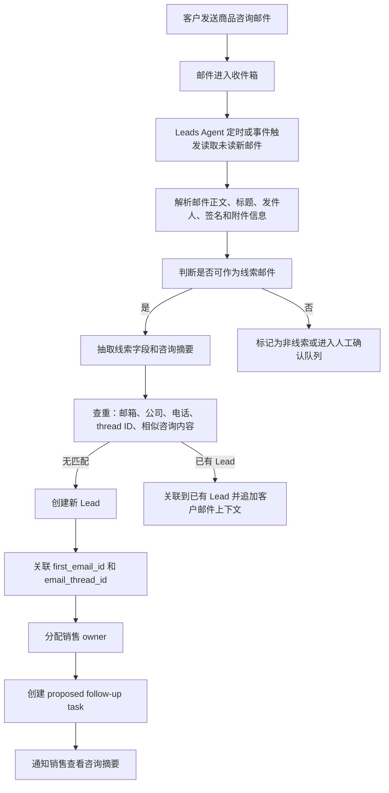
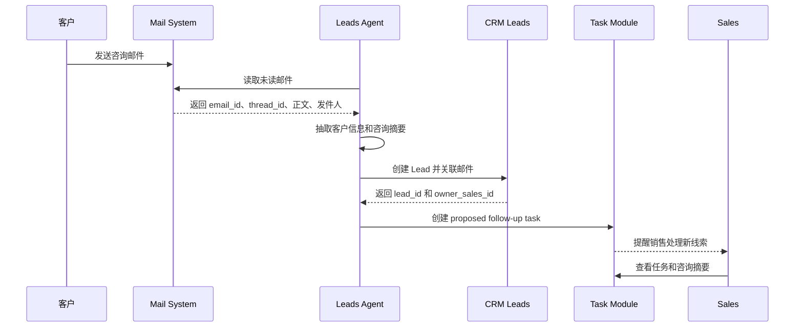
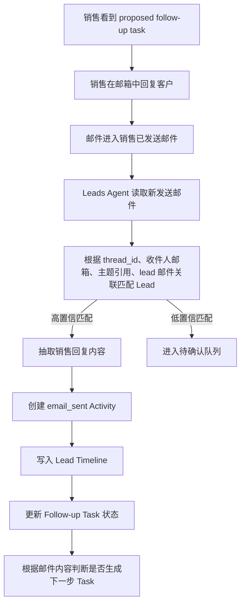
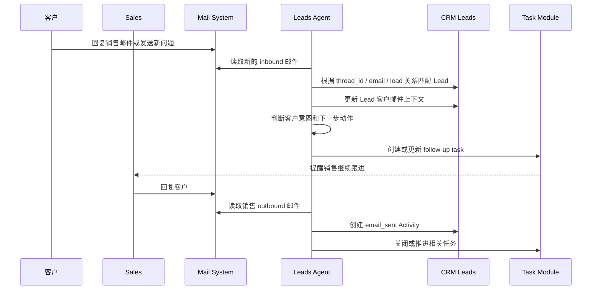
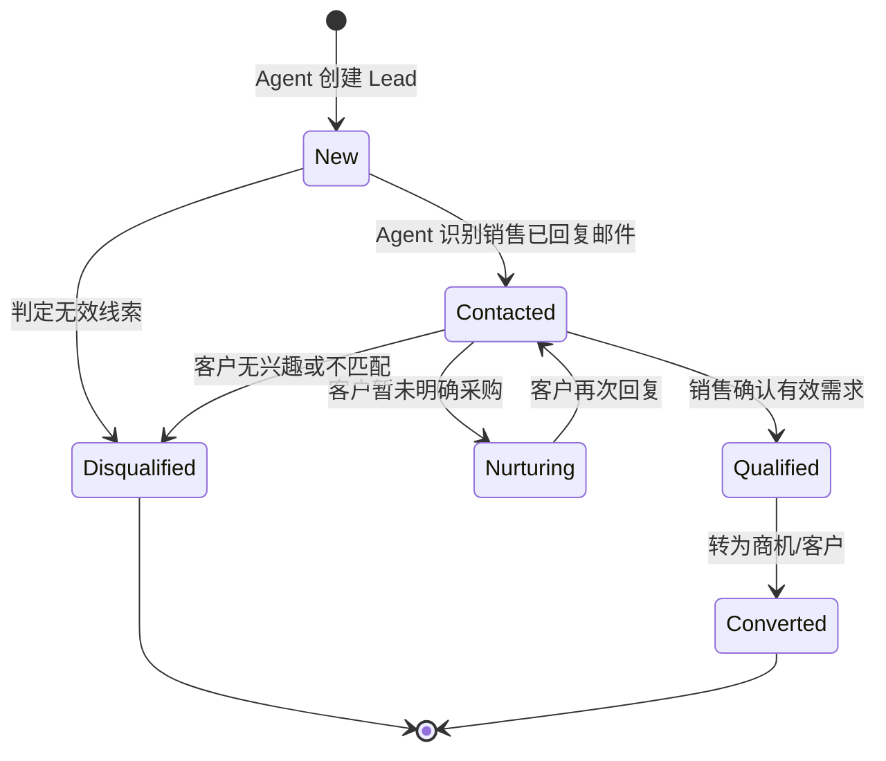
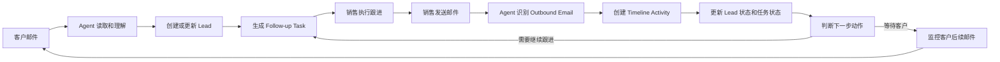

# Leads Agent 业务设计

## 1. 背景与目标

CRM 的 Leads 模块通常承担销售漏斗入口的职责。用户第一次通过邮件咨询商品、价格、试用、合作、采购或技术规格时，这些邮件往往代表潜在线索。如果完全依赖销售手动查看邮箱、复制信息、创建线索、补录跟进记录，会出现以下问题：

- 线索录入不及时，销售可能漏看未读邮件。
- 线索信息不完整，邮件来源、邮件 ID、客户诉求等上下文容易丢失。
- 销售已通过邮件跟进，但 CRM 中没有对应 activity，导致考核数据不准确。
- 后续客户再次回复邮件时，销售缺少自动提醒，线索推进依赖人工记忆。

Leads Agent 的目标是把“客户邮件 -> CRM 线索 -> Follow-up Task 提醒销售 -> 销售执行跟进 -> Agent 创建 Activity 记录销售动作”形成自动化闭环，提高线索创建、跟进提醒和销售行为记录的效率。

核心定义：

- `Follow-up Task`：客户给 sales 发了邮件后，Agent 识别邮件内容，自动生成给 sales 的提醒任务，提示 sales 去跟进。它代表“应该做什么”，是未完成或待处理动作。
- `Activity`：sales 针对某个 lead 已经发生的跟进行为记录。Agent 读取 sales 的已发送邮件、会议记录等内容后，自动创建 activity 并记录到该 lead 的 timeline 下，用于销售跟进考核。它代表“已经做了什么”。

## 2. 业务范围

### 2.1 本期范围

- 读取收件箱中的未读新邮件，并假设符合线索邮件场景。
- 从邮件中提取客户身份、公司、联系方式、商品兴趣、咨询摘要、意向强度等线索信息。
- 创建新的 lead，并关联原始邮件信息和邮件 ID。
- 在线索创建后，基于客户邮件内容为负责销售创建 proposed follow-up task，提醒销售跟进。
- 监控销售发件箱或已发送邮件，识别销售对该线索的跟进行为。
- 基于销售发送的邮件内容，自动抽取关键内容并创建 lead timeline activity。
- 基于 lead、销售 activity、客户新邮件持续生成后续 follow-up task。

### 2.2 暂不展开范围

- 不直接替销售发送邮件。
- 不自动承诺价格、交期、合同条款等敏感事项。
- 不替代 CRM 已有的权限、审批、客户归属和销售分配规则。
- 不处理复杂营销自动化旅程，只聚焦 leads 模块效率提升。

## 3. 关键角色

| 角色 | 说明 |
| --- | --- |
| 客户 / 潜在客户 | 通过邮件咨询商品或服务的人。 |
| Sales / 销售 | 负责跟进 lead、回复邮件、推进线索的人。 |
| Leads Agent | 读取客户邮件、抽取信息、创建 lead、生成 follow-up task，并从销售已发送邮件中识别 activity 的智能代理。 |
| CRM Leads 模块 | 保存 lead 主数据、状态、来源、负责人和 timeline。 |
| Mail System | 提供收件箱、未读邮件、发件箱、已发送邮件和邮件线程 ID。 |
| Task / Notification 模块 | 承载 proposed follow-up task 和销售提醒。 |

## 4. 核心业务对象

### 4.1 Lead

Lead 是客户咨询进入 CRM 后形成的潜在线索。

建议字段：

| 字段 | 说明 |
| --- | --- |
| lead_id | CRM 线索唯一 ID。 |
| name | 客户姓名，无法识别时可为空或使用邮箱前缀作为临时名称。 |
| email | 客户邮箱。 |
| phone | 客户电话，邮件中出现时抽取。 |
| company | 客户公司。 |
| title | 客户职位。 |
| source | 固定为 Email 或具体邮箱渠道。 |
| interested_products | 邮件中提到的商品、服务或方案。 |
| inquiry_summary | 咨询摘要。 |
| intent_level | 意向强度，如 high / medium / low。 |
| status | New、Contacted、Qualified、Disqualified、Converted 等。 |
| owner_sales_id | 负责人销售。 |
| first_email_id | 首封线索邮件 ID。 |
| email_thread_id | 邮件会话 / thread ID。 |
| created_by | Leads Agent。 |
| created_at | 创建时间。 |

### 4.2 Email Reference

Lead 必须关联原始邮件信息，保证后续追踪和审计。

建议字段：

| 字段 | 说明 |
| --- | --- |
| email_id | 邮件系统唯一 ID。 |
| thread_id | 邮件线程 ID。 |
| mailbox | 邮箱账号。 |
| direction | inbound / outbound。 |
| from | 发件人。 |
| to | 收件人。 |
| cc | 抄送人。 |
| subject | 邮件标题。 |
| sent_at | 邮件发送时间。 |
| received_at | 邮件接收时间。 |
| snippet | 邮件片段。 |
| raw_storage_ref | 原始邮件存储引用，避免重复保存大正文。 |

### 4.3 Follow-up Task

Follow-up Task 是客户给 sales 发邮件后，Agent 根据客户邮件内容自动生成的销售跟进提醒。它用于提示 sales 下一步应该做什么，例如回复客户、澄清需求、发送资料、安排会议或检查客户是否有反馈。

它的业务含义是“待发生的销售动作”，不是销售考核记录。初始状态为 proposed，销售可以接受、执行、忽略或关闭。

建议字段：

| 字段 | 说明 |
| --- | --- |
| task_id | 任务唯一 ID。 |
| lead_id | 关联线索。 |
| sales_id | 任务接收销售。 |
| status | proposed、accepted、done、dismissed、expired。 |
| task_type | reply_email、call_customer、send_quote、schedule_meeting、check_status 等。 |
| title | 任务标题。 |
| summary | 咨询摘要或下一步建议。 |
| due_at | 建议处理时间。 |
| reason | Agent 生成任务的业务原因，通常来自客户邮件中的需求、问题、催促或新信息。 |
| source_event_id | 触发任务的客户邮件 ID 或上一条相关事件 ID。 |

### 4.4 Activity

Activity 是 sales 针对某个 lead 已经发生的跟进行为记录，会记录在该 lead 的 timeline 下，并作为销售是否跟进线索的考核来源。

对于邮件场景，activity 由 Agent 读取 sales 已发送邮件后自动抽取生成。客户发来的 inbound 邮件可以作为 lead 上下文或邮件记录保存，但不应算作 sales activity，也不应作为销售考核依据。

建议字段：

| 字段 | 说明 |
| --- | --- |
| activity_id | 活动唯一 ID。 |
| lead_id | 关联线索。 |
| sales_id | 执行动作的销售。 |
| activity_type | email_sent、call、meeting、note 等销售动作类型。 |
| occurred_at | 活动发生时间。 |
| summary | Agent 根据销售跟进行为内容抽取的摘要。 |
| key_points | 关键内容，如报价、资料、约定时间、客户疑问。 |
| source_email_id | 来源邮件 ID。 |
| source_thread_id | 来源邮件线程 ID。 |
| created_by | Leads Agent。 |
| confidence | 邮件与 lead 关联、内容抽取的置信度。 |

## 5. 主业务流程

### 5.1 首封客户咨询邮件创建 Lead

业务说明：

1. Agent 优先处理未读邮件，读取后需要记录处理状态，避免重复创建。
2. 初期可以默认未读新邮件都是线索邮件；后续可增加垃圾邮件、系统通知、内部邮件、售后邮件识别。
3. Lead 创建时必须保存 `first_email_id` 和 `email_thread_id`，后续所有邮件活动都依赖这两个字段做追踪。
4. 如果发现相同邮箱和同一商品组合已经有关联 lead，Agent 不应重复创建 lead，而是追加客户邮件上下文，并按需生成新的 follow-up task。

### 5.2 创建 Proposed Follow-up Task

Task 内容建议：

- 标题：`新邮件线索：客户咨询 {商品/服务}`
- 摘要：客户是谁、来自哪个公司、想了解什么、是否提到预算/数量/时间。
- 建议动作：优先回复邮件，确认需求、补充商品资料或约定沟通时间。
- 截止时间：可按意向强度设置，例如 high 为 2 小时内，medium 为 1 个工作日内。

## 6. 销售回复邮件后自动创建 Activity

销售可能直接在邮箱中回复客户，而不是从 CRM 内部点击执行任务。因此 Agent 需要监控销售邮箱的发件箱或已发送邮件，将销售的真实邮件行为同步为 CRM timeline activity。

Activity 抽取内容示例：

| 邮件内容 | Activity 摘要 |
| --- | --- |
| 销售发送商品资料和报价单 | 已向客户发送商品资料和初步报价，等待客户确认规格和数量。 |
| 销售约客户下周演示 | 已邀请客户参加产品演示，建议在约定时间前准备方案。 |
| 销售询问预算和采购时间 | 已向客户确认预算、采购周期和决策流程。 |

考核口径：

- 只有能够匹配到 `lead_id` 和 `sales_id` 的 outbound email，才可以作为销售跟进 activity。
- Activity 的 `occurred_at` 使用邮件真实发送时间，而不是 Agent 处理时间。
- Activity 应保留 `source_email_id`，便于销售或主管回溯邮件原文。
- 如果销售回复的是同一 thread，但没有通过 CRM 操作，也仍然应记为有效跟进。

## 7. 客户后续来信与持续 Follow-up

未来 Agent 需要持续基于 lead、activity 和客户新邮件生成后续任务。这里的关键不是只创建第一条任务，而是形成持续推进机制。

后续任务触发规则示例：

| 触发事件 | 任务建议 |
| --- | --- |
| 客户询问价格 | 创建 `send_quote` 任务，建议销售发送报价或确认规格。 |
| 客户询问库存 / 交期 | 创建 `confirm_availability` 任务，建议销售确认库存、交付时间。 |
| 客户要求演示 | 创建 `schedule_meeting` 任务。 |
| 销售已发送报价，客户 3 天未回复 | 创建 `check_status` 任务，提醒销售跟进。 |
| 客户表达明确采购计划 | 提升 lead intent_level，并创建高优先级跟进任务。 |
| 客户回复无兴趣 | 建议销售确认关闭原因，必要时将 lead 标记为 disqualified。 |

## 8. Lead 与邮件匹配策略

为了避免 activity 关联错误，需要多维度匹配。

优先级建议：

1. `thread_id` 精确匹配。
2. `in_reply_to` / `references` 邮件头匹配。
3. `source_email_id` 与已有 lead email reference 匹配。
4. 客户邮箱与 lead email 匹配。
5. 邮件标题相似度匹配，例如 Re:、Fwd: 后的原主题。
6. 公司域名、联系人签名、商品关键词辅助匹配。

置信度规则：

| 置信度 | 条件 | 处理 |
| --- | --- | --- |
| High | thread_id 或邮件引用链精确匹配 | 自动创建 activity。 |
| Medium | 客户邮箱匹配且主题相似 | 自动创建 activity，但标记可审查。 |
| Low | 只有商品关键词或公司名相似 | 不自动入账，进入人工确认。 |

## 9. 去重与合并规则

创建 lead 前需要避免重复。

建议规则：

- 同一 `email_thread_id` 只创建一个主 lead。
- 同一客户邮箱在短时间内发送多封相似咨询，优先合并到同一 lead。
- 同一公司不同联系人咨询同一商品，可以根据业务选择创建多个 lead 或创建一个 account 下多个 contacts。
- 如果已有 open lead，则新邮件作为 activity 追加；如果已有 closed lead，按时间间隔和咨询内容判断是否重新打开或新建 lead。

## 10. 状态流转建议

状态自动更新建议：

- Agent 创建 lead 后状态为 `New`。
- Agent 创建销售 outbound email activity 后，可将状态更新为 `Contacted`。
- 是否进入 `Qualified` 建议由销售确认，Agent 可以提出建议但不自动确认。
- `Converted` 通常由 CRM 商机流程触发，不建议 Agent 自动完成。

## 11. Agent 决策边界

Agent 可以自动完成：

- 读取邮件元数据和正文。
- 抽取线索字段。
- 创建 lead。
- 关联邮件 ID、thread ID。
- 创建 proposed follow-up task。
- 读取销售已发送邮件并创建 activity。
- 根据规则生成下一步任务建议。

Agent 应进入人工确认：

- 邮件与多个 lead 都可能匹配。
- 客户身份、公司、商品信息存在明显歧义。
- 邮件内容涉及投诉、法务、退款、合同争议等非线索场景。
- Agent 置信度低但可能影响销售考核。

Agent 不应自动完成：

- 替销售承诺价格、折扣、交期。
- 自动关闭高价值 lead。
- 自动改变销售归属。
- 自动转换商机，除非 CRM 已有明确自动化规则。

## 12. 异常与边界场景

| 场景 | 处理建议 |
| --- | --- |
| 邮件没有客户姓名 | 使用邮箱作为临时标识，task 中提示销售补全。 |
| 邮件只有附件没有正文 | 抽取附件名称和邮件主题，必要时进入人工确认。 |
| 客户一封邮件咨询多个商品 | Lead 中记录多个 interested_products，task 摘要提示销售拆分或确认主需求。 |
| 销售多人同时回复同一客户 | Activity 分别记录，lead owner 不自动变更。 |
| 客户换邮箱继续沟通 | 根据公司、姓名、签名和主题识别，置信度不足时人工确认。 |
| 销售转发给内部同事 | 如果收件人是内部邮箱，默认创建 internal_note activity，不算客户跟进。 |
| 邮件包含敏感信息 | 只抽取必要摘要，原文按邮件系统权限访问。 |

## 13. 业务指标

Leads Agent 上线后建议观察以下指标：

| 指标 | 说明 |
| --- | --- |
| lead 自动创建率 | 新线索中由 Agent 创建的比例。 |
| lead 创建及时性 | 客户邮件到 CRM lead 创建的平均耗时。 |
| 邮件关联准确率 | lead 与 email/thread 的正确关联比例。 |
| activity 自动生成率 | 销售邮件被自动记录为 activity 的比例。 |
| activity 误关联率 | 错误归属到 lead 或 sales 的比例。 |
| 首次响应时间 | 客户首封邮件到销售首次回复的耗时。 |
| follow-up task 完成率 | proposed task 被销售处理的比例。 |
| 线索转化率 | Agent 处理线索最终进入商机或客户的比例。 |

## 14. MVP 建议

MVP 可以按以下阶段落地：

### 阶段 1：邮件入站创建 Lead

- 读取未读收件箱邮件。
- 抽取基础 lead 字段。
- 创建 lead 并关联 `first_email_id`、`email_thread_id`。
- 创建 proposed follow-up task。

### 阶段 2：销售发件箱生成 Activity

- 读取销售已发送邮件。
- 根据 thread ID 和客户邮箱匹配 lead。
- 自动创建 email_sent activity。
- 将相关 task 更新为 done 或 waiting_customer。

### 阶段 3：持续跟进任务

- 读取客户后续 inbound 邮件。
- 更新 lead 客户邮件上下文。
- 基于客户意图生成新的 proposed task。
- 对长时间无回复的 lead 生成提醒任务。

### 阶段 4：质量和治理

- 增加低置信匹配人工确认队列。
- 增加 lead 去重和合并建议。
- 增加销售主管可审查的 activity 生成记录。
- 增加误判反馈机制，用于优化 Agent 抽取和匹配。

## 15. 总体闭环

这套设计的核心是：Agent 不只是“帮 CRM 建线索”，而是持续维护 lead 的上下文，把邮件沟通自动转成 CRM 可见、可追踪、可考核的业务记录，同时用 proposed task 推动销售在正确时间做下一步动作。
