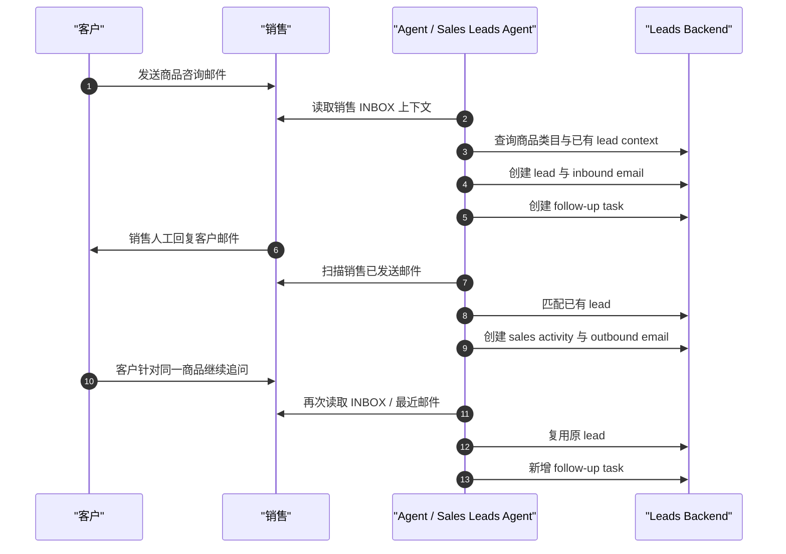
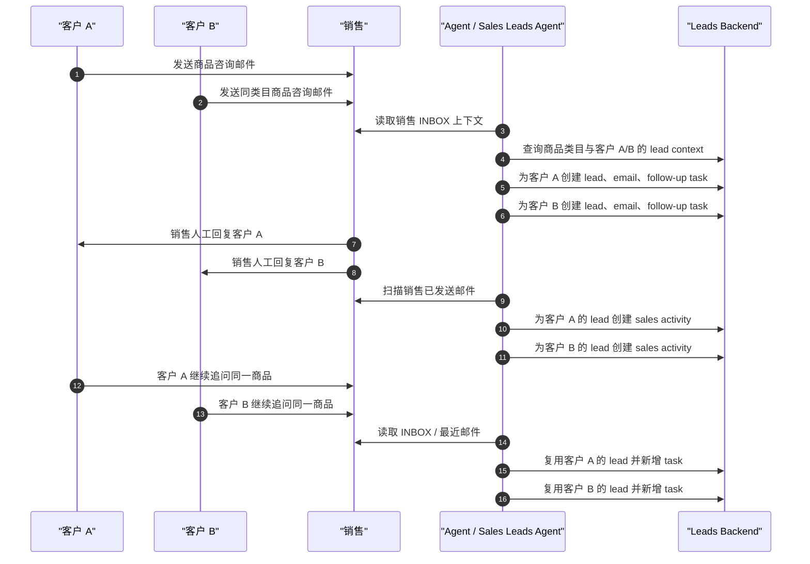
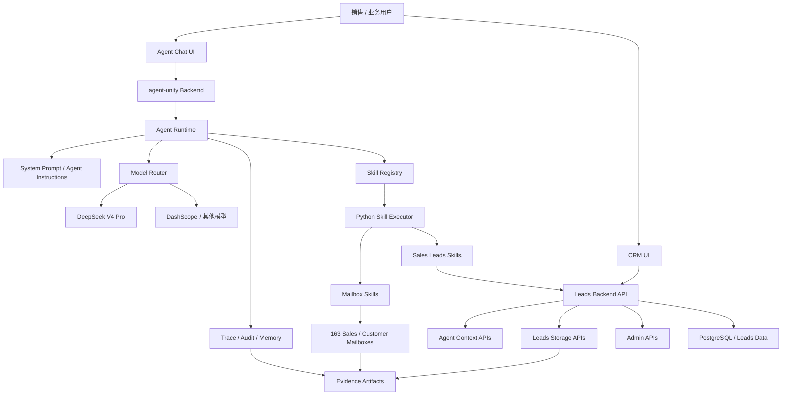

# Sales Leads Agent POC 汇报

## 1. POC 背景

本次 POC 面向销售线索处理场景：客户通过真实邮箱咨询产品，销售人员通过自己的邮箱回复客户，系统中的 Sales Leads Agent 需要像销售助理一样观察邮箱上下文，并把业务过程沉淀到 CRM 后端。

POC 不是验证一个孤立的聊天机器人，而是验证一条可落地的销售工作链路：

- 客户新咨询到达销售邮箱后，Agent 识别客户、产品类目和需求，创建 lead 与 follow-up task。
- 销售人员自己回复客户后，Agent 读取销售已发送邮件，生成 sales activity。
- 客户继续追问同一产品时，Agent 复用原 lead，新增 follow-up task，不重复创建 lead。
- 不同客户咨询同一商品类目时，Agent 创建不同 lead。

本轮证据已经归档到：

- 总览证据：[evidence/sales-leads-agent-two-scenarios/SUMMARY.md](./evidence/sales-leads-agent-two-scenarios/SUMMARY.md)
- 简单场景：[SALES-E2E-SIMPLE-20260531060002/EVIDENCE.md](./evidence/sales-leads-agent-two-scenarios/SALES-E2E-SIMPLE-20260531060002/EVIDENCE.md)
- 复杂场景：[SALES-E2E-COMPLEX-20260531060204/EVIDENCE.md](./evidence/sales-leads-agent-two-scenarios/SALES-E2E-COMPLEX-20260531060204/EVIDENCE.md)
- 邮件时间轴：[poc-email-playbook-timeline.md](./poc-email-playbook-timeline.md)

## 2. Leads Agent 的业务价值

Sales Leads Agent 的目标是服务销售，而不是替代销售对客户发邮件。它承担的是“上下文观察、结构化沉淀、行动建议和过程审计”的工作。

核心业务价值：

- 降低线索遗漏：客户邮件进入销售邮箱后，Agent 自动识别是否是新咨询或追问，避免销售手工筛选邮箱。
- 提升响应质量：Agent 根据客户诉求生成 follow-up task，帮助销售明确下一步该问什么、补什么资料、如何推进。
- 沉淀销售过程：销售回复客户后，Agent 自动生成 activity，让 CRM timeline 真实反映销售动作。
- 保持线索边界清晰：同客户同商品复用 lead，同客户不同一级类目新建 lead，不同客户同商品不合并。
- 支撑管理复盘：每个 lead、email、task、activity 都可追溯到邮箱证据和 Agent 执行记录。

本次 POC 已通过真实邮箱和真实后端验证：

| 场景 | Run ID | 验证结果 | 最终计数 |
| --- | --- | --- | --- |
| 单客户多轮 | `SALES-E2E-SIMPLE-20260531060002` | PASS | `1 lead / 3 emails / 2 tasks / 1 activity` |
| 双客户多轮 | `SALES-E2E-COMPLEX-20260531060204` | PASS | `2 leads / 6 emails / 4 tasks / 2 activities` |

## 3. POC 场景概览

本次 POC 选择“真实邮箱 + 真实后端 + 真实 Agent 调度”的方式验证 Sales Leads Agent，而不是只做静态 demo。场景设计围绕销售日常最高频、最容易遗漏的三个动作展开：客户来信形成线索、销售回复形成活动、客户追问形成新的跟进任务。

从销售视角看，Agent 自动化承担的是“销售助理”的工作：它不替销售发邮件、不替销售承诺商务条件，而是在销售邮箱旁边持续观察上下文，把散落在邮件里的客户意向、销售动作和下一步待办自动整理进 CRM。销售只需要正常收发邮件，Agent 会在后台完成线索识别、任务生成、活动记录和过程沉淀。

| 场景 | 业务过程 | 验证重点 | 通过标准 |
| --- | --- | --- | --- |
| 单客户多轮咨询 | 一个客户咨询一抗产品，销售回复，客户继续补充需求 | 同客户同商品应保持同一条 lead，客户追问只新增 follow-up task | `1 lead / 3 emails / 2 tasks / 1 activity` |
| 双客户同类目咨询 | 两个客户分别咨询一抗产品，销售分别回复，两个客户继续追问 | 不同客户即使咨询同一类目，也应形成独立 lead 和独立销售过程 | `2 leads / 6 emails / 4 tasks / 2 activities` |
| Agent 自主处理 | 用户只输入“检查邮箱上下文”等自然语言指令 | Agent 不依赖 runId、uid、productCode、leadId 等测试参数，自主读取邮箱和后端上下文 | transcript 中由 Agent 自主调用邮箱、商品、lead context 和写入 skills |
| 销售边界验证 | 销售邮件由销售邮箱真实发出，Agent 只读取已发送邮件 | Agent 不代替销售发信，只把销售回复沉淀为 activity | 普通检查流程不调用 `mail_163_sender` |

### 3.1 Agent 如何为 Sales 自动化处理任务

整个 POC 可以理解为一条销售工作闭环，Agent 在每一步都承担明确的自动化职责：

1. 客户通过真实邮箱咨询产品。  
   Agent 读取销售 `INBOX`，判断这是否是一封有效的客户产品咨询，而不是普通通知、垃圾邮件或已处理邮件。

2. Agent 自动识别客户与需求。  
   Agent 从邮件中抽取客户邮箱、客户名称、产品关键词、应用场景、数量/交期/资料诉求，并调用商品类目查询能力，把自然语言咨询映射到后端已有商品类目。

3. Agent 自动创建或匹配 lead。  
   如果这是新客户或新商品类目咨询，Agent 创建新 lead；如果是同客户同商品的继续追问，Agent 复用原 lead，避免重复建线索。

4. Agent 自动生成 follow-up task。  
   Agent 根据客户邮件内容生成给销售的待办，例如“补充 datasheet、验证数据、库存和报价”“确认目标蛋白、样本类型和应用场景”。这些任务直接落到 CRM，帮助销售知道下一步该做什么。

5. 销售人员人工回复客户。  
   销售仍然通过自己的邮箱真实回复客户。这个边界很重要：Agent 不冒充销售、不自动对客户发信。

6. Agent 自动同步 sales activity。  
   Agent 扫描销售 `已发送/Sent` 邮件，识别销售已经完成的客户跟进动作，匹配对应 lead，并在 CRM 中生成 activity，让管理者能看到销售实际推进过程。

7. 客户继续追问时，Agent 自动追加任务。  
   如果客户补充需求、要求报价或请求资料，Agent 不重复创建 lead，而是基于原 lead 追加新的 follow-up task，保持销售过程连续。

8. 全过程进入 CRM 和 evidence。  
   lead、email、task、activity、timeline、Agent transcript 和 mailbox records 都被保留下来，既服务销售日常工作，也支持 POC 验收和后续复盘。

这组场景覆盖了 Sales Leads Agent 的核心价值：不替代销售沟通，但持续观察销售上下文，把分散在邮箱里的客户意向、销售动作和下一步任务自动沉淀为结构化 CRM 数据。

### 3.2 关键业务对象与生成策略

本 POC 中，Agent 主要沉淀三类 CRM 业务对象：`lead`、`follow-up task` 和 `sales activity`。三者分别回答不同问题：这个客户机会是什么、销售下一步该做什么、销售已经做了什么。

| 对象 | 含义 | 由什么触发 | 生成策略 |
| --- | --- | --- | --- |
| Lead | 一条销售线索，表示某个客户对某个商品类目存在明确咨询或潜在采购意向 | 客户发到销售邮箱的产品咨询邮件 | 按“客户邮箱 + 商品类目”识别线索边界；新客户/新商品类目创建新 lead，同客户同商品继续复用原 lead |
| Follow-up task | 给销售的下一步跟进建议，表示需要销售补充资料、报价、确认需求或安排沟通 | 客户初始咨询或后续追问中出现需要销售响应的新需求 | 只从客户入站邮件生成；同一客户同一商品追问不新建 lead，但会根据新增需求创建新的 task |
| Sales activity | 销售已经发生的动作记录，表示销售对客户做过一次邮件跟进 | 销售邮箱已发送给客户的业务回复邮件 | 只从销售已发送邮件生成；Agent 匹配已有 lead 后创建 activity，不代表销售发信，也不从销售邮件创建 task |

生成策略的核心边界如下：

- 客户入站邮件：可以创建 lead、email、follow-up task，但不能创建 sales activity。
- 销售出站邮件：可以创建 outbound email、sales activity，但不能创建 lead 或 follow-up task。
- 同客户同商品类目：复用同一条 lead，客户新追问转化为新的 follow-up task。
- 同客户不同一级类目：视为新的业务机会，创建新的 lead。
- 不同客户同商品类目：分别创建独立 lead，避免把两个客户的销售过程合并。
- 重复扫描同一封邮件：通过 provider email/source email 幂等保护，避免重复创建 task 或 activity。

## 4. POC Leads Agent 的能力与实现细节

### 4.1 设计思想：把 Agent 做成可控的销售助理

Sales Leads Agent 的核心设计不是“让大模型自由聊天”，而是把销售线索处理拆成一条可配置、可插拔、可审计的 Agent 工作流。用户只需要输入一句自然语言，例如“检查销售邮箱上下文，处理新的客户咨询邮件，并在需要时创建 lead 与 follow-up task”，Agent 自己读取邮箱和后端上下文，判断应该创建 lead、follow-up task，还是同步 sales activity。

这套设计有几个关键思想：

- 插件化：邮箱读取、商品识别、线索查询、任务创建、activity 创建都封装成独立 skills，Agent 负责选择和编排。
- 配置化：Agent 的 prompt、模型、skills 装配和销售邮箱上下文可配置，避免把客户邮箱、产品类目或流程写死。
- Skill 围栏：模型负责理解和决策，skill 负责执行前校验、方向判断、幂等保护和后端写入，防止模型误判直接污染数据。
- 运行可控：每次执行都有 trace，能看到 Agent 调用了什么 skill、输入输出是什么、耗时多久、最终写入了什么。
- 证据可回放：邮箱记录、Agent transcript、后端 records 和 validation table 都落盘，POC 结果可复核，不依赖口头演示。

### 4.2 Agent 的业务决策方式

Agent 按“观察上下文 -> 分类邮件 -> 查询业务上下文 -> 写入 CRM -> 输出摘要”的模式执行：

- 观察邮箱：区分销售 `INBOX` 和 `已发送/Sent`，识别客户入站邮件与销售出站邮件。
- 识别意图：判断邮件是新咨询、同 lead 追问、销售回复，还是非业务/已处理邮件。
- 匹配业务对象：结合客户邮箱、商品类目、邮件主题和已有 timeline，判断是否复用 lead。
- 写入业务结果：客户入站邮件只创建 lead/email/task；销售出站邮件只创建 outbound email/activity。
- 精简反馈：最终只回答是否新建 lead、是否新建 follow-up task、是否新建 activity，以及原因。

这个设计保证 Agent 不代替销售给客户发邮件，而是服务销售：发现机会、建议动作、沉淀过程。

### 4.3 Skills 的设计亮点

Skills 不是简单 API wrapper，而是 Agent 运行时的工程化边界。

| 设计点 | 说明 | 业务价值 |
| --- | --- | --- |
| 邮箱观察 skills | 支持未读同步、邮件详情、最近邮件扫描、测试清理 | 让 Agent 能基于真实邮箱状态工作，不依赖人工提供 UID |
| 商品类目 reference skill | 将商品目录沉淀为可查询 reference，并结合后端类目搜索 | 降低模型对商品类目的误判，支持通用产品咨询 |
| Lead context skill | 按客户、商品、主题查询已有 lead、task、activity | 支持同客户同商品复用 lead，不同客户隔离 |
| 写入型 skills | 分别负责 lead、follow-up task、sales activity 写入 | 保持业务动作边界清晰，便于审计和排障 |
| 方向校验 | INBOX 客户邮件才能建 lead/task，Sent 销售邮件才能建 activity | 防止销售邮件被误建成新线索，客户邮件被误建成 activity |
| 幂等保护 | 基于 provider email、source email、subject/body 摘要等维度去重 | 防止重复扫描邮件导致重复 task 或 activity |
| 动态上下文 | 基于当前 sales mailbox、folder、from/to 判断方向 | 避免 hardcode 邮箱，支持未来切换销售账号 |

### 4.4 后端在 Agent 中的角色

Leads backend 保持为 storage/context service，不把业务推断硬编码在后端。它提供三类能力：

- 业务存储：leads、emails、lead-emails、follow-up tasks、sales activities、timeline。
- Agent 上下文：商品类目搜索、lead 匹配、provider email 去重查询。
- 管理能力：数据 cleanup、商品类目初始化、CRM 页面真实数据查询。

这样的分工让 Agent/LLM 成为业务理解 owner，后端成为稳定的数据与上下文层，skills 则负责把两者安全连接起来。

### 4.5 Skill 设计沉淀的工程经验

本次 POC 的经验不是某几个具体问题的修补，而是沉淀了一套面向业务 Agent 的 skill 设计方法。核心原则是：让模型负责理解和决策，让 skill 负责边界、校验、上下文、幂等和证据。

| 经验类别 | 设计原则 | 对 Agent 落地的价值 |
| --- | --- | --- |
| 上下文先行 | 写入前先提供只读 context skills，让 Agent 能查询商品、客户、历史 lead、已有任务和活动 | Agent 不再凭单封邮件孤立判断，而是基于业务上下文决策 |
| 业务边界显式化 | 在 skill 层明确区分客户入站、销售出站、线索、任务、活动的职责边界 | 避免模型把销售动作、客户需求和 CRM 对象混在一起 |
| 决策与执行分离 | Agent 负责判断“应该做什么”，skill 负责“能不能做、如何安全写入” | 保留模型灵活性，同时降低数据污染风险 |
| 围栏内置 | 关键 skill 内置方向校验、必填参数校验、产品类目校验和异常返回 | 即使模型参数不完美，skill 也能拒绝越界动作并给出可定位错误 |
| 幂等优先 | 所有写入动作都考虑重复扫描、重复调用、重复邮件的问题 | Agent 可以反复检查上下文，而不会反复创建脏数据 |
| 配置化与可迁移 | skill 不绑定固定客户邮箱、固定销售邮箱或固定产品案例，而是从上下文和配置中获取角色信息 | 同一套能力可以迁移到更多销售账号、客户邮箱和商品类目 |
| 可观测与可审计 | skill 输入、输出、错误和写入结果都进入 trace/evidence | 业务方能看懂 Agent 为什么执行，工程方能快速定位问题 |
| Reference 化知识 | 将商品目录、业务口径和选择依据沉淀为可查询 reference，而不是写死在 prompt 中 | 降低模型幻觉，提高类目识别和业务解释的一致性 |

## 5. POC 场景执行流程

### 5.1 单客户多轮场景

验证目标：一个客户围绕同一商品类目咨询、销售回复、客户追问时，系统保持一个 lead，并追加任务与销售 activity。

证据目录：[SALES-E2E-SIMPLE-20260531060002](./evidence/sales-leads-agent-two-scenarios/SALES-E2E-SIMPLE-20260531060002/EVIDENCE.md)

执行结果：

- lead：1 条。
- email：3 条，包含客户初始咨询、销售回复、客户追问。
- follow-up task：2 条，分别来自客户初始咨询和追问。
- sales activity：1 条，来自销售人工回复。

### 5.2 双客户多轮复杂场景

验证目标：两个真实客户邮箱咨询同一商品类目时，系统创建两个独立 lead；销售分别回复后，Agent 分别生成 activity；两个客户继续追问后，Agent 分别追加 follow-up task。

证据目录：[SALES-E2E-COMPLEX-20260531060204](./evidence/sales-leads-agent-two-scenarios/SALES-E2E-COMPLEX-20260531060204/EVIDENCE.md)

执行结果：

- lead：2 条，不同客户邮箱各 1 条。
- email：6 条，包含 2 封客户咨询、2 封销售回复、2 封客户追问。
- follow-up task：4 条，每位客户初始咨询和追问各 1 条。
- sales activity：2 条，对应销售分别回复两个客户。

## 6. 与 Harness Engineering 思想一致的系统稳定性设计

本系统不是简单把 LLM 接到邮箱，而是把 Agent 执行放进一个稳定、可观测、可审计、可回放、可治理的工程体系中。这一点与 Harness Engineering 的核心思想一致：复杂自动化能力必须被编排、被观测、被审计，并能在失败时快速定位和恢复。

工程化稳定性体现在：

- 执行可编排：Agent prompt、skills、后端 context service 组成可复用业务链路，邮箱观察、商品识别、上下文查询、业务写入都拆成明确步骤。
- 过程可观测：trace 面板记录每个 skill 的开始、结束、输入、输出、耗时和结果，方便业务方看到 Agent 为什么这么做。
- 结果可回放：`mailbox-records.json`、`backend-records.json`、`agent-chat-transcript.json` 保留完整证据，支持复盘与验收。
- 行为可审计：lead、email、task、activity 都保留来源、方向和关联关系，能够追溯到客户邮件或销售邮件。
- 失败可定位：当出现多建 lead、少建 activity、误建 task 时，可以从 trace、邮箱记录、backend records 判断问题属于模型决策、skill 参数、接口返回还是数据幂等。
- 边界可治理：`INBOX` 客户邮件只走 lead/task，`Sent` 销售邮件只走 activity；skills 继续做方向校验与幂等保护，避免模型一次误判造成数据污染。
- 能力可扩展：通过 Skill Registry、Agent 装配、模型路由和 context service，可以继续扩展新邮箱、新产品类目、新 CRM 对象和新业务流程。

因此，这个 POC 展示的是一个先进工程化 Agent 平台实践：Agent 负责业务理解与决策，skills 负责稳定执行，后端提供上下文和存储能力，trace/evidence 提供可证明的交付闭环。

## 7. agent-unity 系统架构

架构说明：

- Chat UI 提供 Agent 交互入口，业务用户可以用自然语言触发“检查新线索、生成 follow-up task、同步 activity”。
- CRM UI 直接读取 Leads backend 的真实数据，展示 leads、tasks、activities 和 timeline。
- agent-unity backend 管理 Agent、skills、会话、模型路由、trace、memory、audit 和多 Agent 编排。
- Agent Runtime 将系统提示词、用户指令、可用 skills 与模型组合起来，形成可执行的销售助理。
- Skill Registry 将 skills 注册入库，Agent 可以按配置装配能力，不需要把业务流程写死在一个服务里。
- Python Skill Executor 负责执行邮箱、商品查询、上下文查询和 CRM 写入等工具能力。
- Model Router 支持 DeepSeek V4 Pro、DashScope 等模型切换，为不同任务选择合适模型。
- Leads backend 作为 storage/context service，提供数据查询、幂等写入、timeline 聚合和管理接口。
- Trace 和 Evidence 机制让 POC 从“看起来能跑”变成“可证明、可复盘、可交付”。

### 平台能力亮点

agent-unity 平台对本 POC 的支撑能力包括：

- Agent 可配置：Agent prompt、模型、skills 装配均可独立配置和迭代。
- Skill 可复用：邮箱、商品查询、lead context、业务写入能力可以被不同 Agent 复用。
- Trace 可视化：每次 Agent 执行都能看到 skill 调用链和执行结果。
- 多模型可路由：模型能力不足时，可以通过模型路由替换或升级，而不重写业务 skills。
- 多 Agent 可扩展：平台已有 supervisor、pipeline、routing、handoff 等多 Agent 编排基础，可继续扩展复杂销售流程。
- 审计可沉淀：执行日志、用户反馈、Agent 消息和后端业务数据可以共同支撑验收与治理。

## 8. 总结与实施价值

本 POC 已证明：Sales Leads Agent 可以基于真实邮箱上下文，自主识别客户咨询、创建 sales lead、生成 follow-up task，并在销售人工回复后生成 sales activity。Agent 不越权发信，而是作为销售助理沉淀数据、提示动作、补齐 CRM 过程。

从业务侧看，它帮助销售减少遗漏、提升跟进质量、沉淀客户过程。从技术侧看，它通过 Agent + Skills + Backend + Trace + Evidence 的组合，把 LLM 能力放进可治理的工程体系中。从平台侧看，agent-unity 展示了快速落地新业务场景的能力：新建 Agent、装配 skills、接入后端 context、跑真实 E2E、沉淀可审计证据。

这为后续争取实施资格提供了三个关键证明：

- 业务理解到位：线索、任务、活动的边界符合销售工作流。
- 技术实现可落地：真实邮箱、真实后端、真实 CRM 页面均可联动。
- 平台能力可扩展：同一套工程化 Agent 平台可以继续支持更多销售场景、产品类目和企业系统集成。
