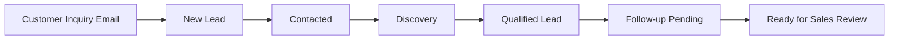
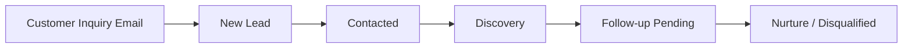
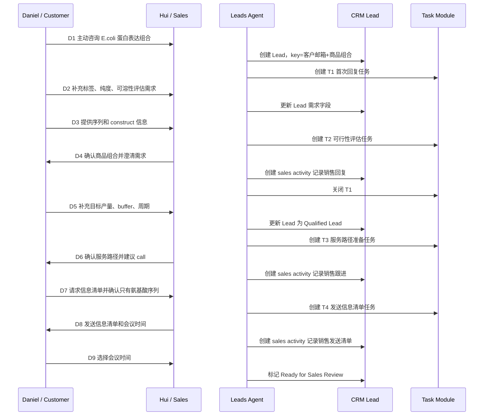
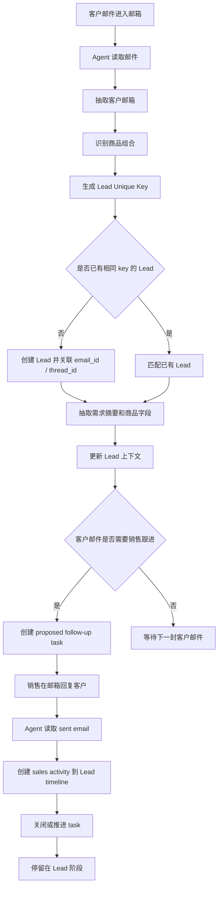

# Leads Agent 测试用户故事线：单销售线索阶段邮件往来

## 1. 文档目的

本文档用于准备 Leads Agent 的业务测试故事线。当前 scope 只覆盖 **Lead 线索阶段**，不进入下一阶段 Opportunity，不设计商机创建、商机推进、报价审批或采购流程。

本轮重点增加一个关键业务约束：

```text
Lead 唯一判定标准 = 客户邮箱 + 商品组合
```

也就是说，`客户邮箱` 单独不能唯一确定一个线索。同一个客户可以同时咨询不同商品组合，每个商品组合应形成不同 lead；同一个客户围绕同一个商品组合持续补充信息，则应匹配并更新同一个 lead。

测试目标是验证 Agent 是否能在一个销售与一个客户持续邮件沟通的过程中：

- 从客户邮件中识别客户邮箱和商品组合。
- 基于 `客户邮箱 + 商品组合` 创建或更新 lead。
- 识别客户发来的邮件内容，并生成 proposed follow-up task 给销售，提醒销售跟进。
- 在销售通过邮箱回复客户后，自动为该 lead 创建对应 activity，记录到 lead timeline 下，用于销售跟进考核。
- 当客户出现“可进入商机阶段”的信号时，只在 lead 内记录并提醒销售人工判断，Agent 不创建 opportunity。

约束：

- 故事线中只有一个销售：`Hui Li`。
- 销售邮箱：`gs_sales_01@163.com`
- 客户邮箱：`gs_customer_01@163.com`
- 每条主测试链路只围绕一个客户与销售的邮件往来。
- 文档终点停留在线索阶段，不进入 Opportunity。

## 2. 核心对象定义

### 2.1 Activity

`Activity` 是 sales 针对某个 lead 已经发生的跟进行为记录。Agent 会读取 sales 已发送邮件等信息，自动创建 activity，并记录到该 lead 的 timeline 下面。

Activity 的用途是销售跟进考核，回答的是：

```text
Sales 是否已经对这个线索做了跟进？
Sales 具体做了什么？
Sales 什么时候做的？
```

在本故事线中，只有销售 Hui 发给客户 Daniel 的邮件才会生成 sales activity。客户发来的邮件用于更新 lead 上下文和触发 follow-up task，但不算销售 activity。

### 2.2 Follow-up Task

`Follow-up Task` 是客户给 sales 发了邮件后，Agent 识别邮件内容，自动生成的销售提醒任务。

Follow-up Task 的用途是提醒销售下一步该跟进什么，回答的是：

```text
客户提出了什么需求或问题？
Sales 下一步应该做什么？
这个提醒由哪封客户邮件触发？
```

Follow-up Task 代表“待做动作”；Activity 代表“已完成动作”。

## 3. 商品组合与 Lead 唯一性

### 3.1 本故事线商品组合

本故事线选择金斯瑞商品类目中的以下组合：

```text
RSBU
└── Protein（蛋白）
    └── Protein Expression E.coli（大肠杆菌蛋白表达）
        ├── E.coli - Protein（大肠杆菌蛋白表达）
        ├── E.coli - HTP（大肠杆菌高通量蛋白表达）
        └── E.coli Product（大肠杆菌蛋白产品）
```

### 3.2 本故事线 Lead Unique Key

```text
客户邮箱: gs_customer_01@163.com
商品组合: RSBU > Protein > Protein Expression E.coli
Lead Unique Key: gs_customer_01@163.com + RSBU > Protein > Protein Expression E.coli
```

### 3.3 商品组合识别同义词

Agent 应将客户邮件中的以下表达都归一到同一个商品组合：

- 大肠杆菌蛋白表达
- E.coli protein expression
- E.coli expression package
- E.coli HTP expression
- 大肠杆菌表达纯化
- E.coli recombinant protein
- E.coli expression screening

### 3.4 唯一性规则

| 场景 | Agent 预期 |
| --- | --- |
| 同一客户邮箱继续补充 E.coli 蛋白序列、标签、表达量、纯化要求 | 匹配已有 lead |
| 同一客户邮箱改为咨询 mRNA/LNP 表征 | 创建新 lead |
| 同一客户邮箱改为咨询 peptide synthesis | 创建新 lead |
| 不同客户邮箱咨询同一个 E.coli 蛋白表达组合 | 创建不同 lead |
| 同一邮件提到 E.coli 主需求，并顺带问 gene synthesis | 仍以 E.coli protein expression 为主 lead，gene synthesis 可作为附加需求记录 |

## 4. Lead 阶段标准跟进过程

当前阶段模型只描述 Lead 内部生命周期。最后的 `Ready for Sales Review` 不是 Opportunity，它只是说明这个 lead 已经出现可由销售人工判断是否进入下一阶段的信号。

| 阶段 | 阶段名称 | 业务含义 | 典型进入条件 | Agent 重点能力 |
| --- | --- | --- | --- | --- |
| 0 | Customer Inquiry Email | 客户主动咨询邮件 | 客户主动发送商品组合咨询、报价咨询、技术可行性咨询 | 读取未读新邮件，识别客户邮箱和商品组合 |
| 1 | New Lead | 已创建线索，等待销售首次有效动作 | Agent 基于客户邮箱 + 商品组合创建 lead | 生成首次 follow-up task |
| 2 | Contacted | 销售已联系客户 | Agent 识别销售 outbound email | 创建 sales activity，关闭首次跟进任务 |
| 3 | Discovery | 客户正在补充需求 | 客户提供序列、标签、表达体系、数量、纯度、周期等信息 | 抽取需求点，生成澄清任务 |
| 4 | Qualified Lead | 线索在 lead 阶段已较清晰 | 商品组合、目标数量、主要技术要求较明确 | 提醒销售准备资料、报价前信息或会议 |
| 5 | Follow-up Pending | 已发送资料/问题，等待客户反馈 | 销售已回复，客户暂未继续反馈 | 创建等待客户回复的 follow-up task |
| 6 | Ready for Sales Review | 出现可能进入下一阶段的信号 | 客户确认会议、要求费用信息、要求正式范围说明 | 只生成销售 review task，不创建 opportunity |
| 7 | Nurture / Disqualified | 暂缓或无效 | 客户无兴趣、需求不匹配、长期无响应 | 记录原因，生成低频培育任务或关闭建议 |

### 阶段流转图

场景 A：客户积极推进，Lead 逐步成熟，但仍停留在线索阶段。



场景 B：客户暂缓或无响应，Lead 进入培育或无效线索处理。



## 5. 主故事线：Daniel 的 E.coli Protein Expression Lead

### 4.1 业务背景

客户 Daniel Villarreal 主动发送邮件给销售 Hui Li，咨询大肠杆菌蛋白表达组合服务。客户希望针对 3 个候选重组蛋白先做 E.coli 小规模表达筛选和纯化评估，如果表达情况合适，后续可能放大制备用于体外功能实验。

Agent 读取这封未读客户邮件后，应将其作为新的 lead 入口，并使用以下 key 创建线索：

```text
gs_customer_01@163.com + RSBU > Protein > Protein Expression E.coli
```

这条故事线用于测试 Lead 阶段内的完整闭环：

- 客户主动发起商品组合咨询。
- Agent 识别客户邮箱和商品组合。
- Agent 按 `客户邮箱 + 商品组合` 创建 lead。
- Agent 生成 proposed follow-up task。
- 销售通过邮箱继续跟进。
- Agent 自动创建销售 activity，记录到 lead timeline，用于销售跟进考核。
- 客户继续补充序列、标签、表达量、纯度和周期等信息。
- Agent 继续生成下一步 task。
- 直到 lead 达到 `Ready for Sales Review`，但不进入 Opportunity。

### 5.2 Lead 初始信息

| 字段 | 建议值 |
| --- | --- |
| lead_name | Daniel Villarreal - E.coli Protein Expression Package |
| lead_unique_key | gs_customer_01@163.com + RSBU > Protein > Protein Expression E.coli |
| sales_owner | Hui Li |
| sales_email | gs_sales_01@163.com |
| customer_name | Daniel Villarreal |
| customer_email | gs_customer_01@163.com |
| company | Bionova Scientific, LLC |
| lead_source | Customer inbound inquiry email |
| product_category | RSBU > Protein > Protein Expression E.coli |
| product_category_cn | RSBU > 蛋白 > 大肠杆菌蛋白表达组合 |
| intent_level | High |
| initial_need | E.coli protein expression package for 3 recombinant proteins |
| current_stage | Discovery |

## 6. Daniel 邮件时间线

| Step | 时间 | 方向 | 角色 | 邮件主题 | 业务事件 | Lead 阶段影响 |
| --- | --- | --- | --- | --- | --- | --- |
| D1 | 2026-05-21 03:03 | Customer -> Sales | Daniel -> Hui | 大肠杆菌蛋白表达组合服务咨询 | Daniel 主动咨询 E.coli 蛋白表达组合，涉及 3 个候选重组蛋白 | New Lead / Discovery / High Intent |
| D2 | 2026-05-21 05:30 | Customer -> Sales | Daniel -> Hui | Re: 大肠杆菌蛋白表达组合服务咨询 | Daniel 补充 N-terminal His tag、目标纯度和可溶性评估需求 | Discovery |
| D3 | 2026-05-21 06:55 | Customer -> Sales | Daniel -> Hui | Re: 大肠杆菌蛋白表达组合服务咨询 | Daniel 提供序列和 construct 初步信息，并询问是否适合 E.coli 表达 | Qualified Lead |
| D4 | 2026-05-21 09:20 | Sales -> Customer | Hui -> Daniel | Re: 大肠杆菌蛋白表达组合服务咨询 | Hui 确认商品组合并澄清表达、纯化和交付要求 | Contacted / Discovery |
| D5 | 2026-05-22 02:15 | Customer -> Sales | Daniel -> Hui | Re: 大肠杆菌蛋白表达组合服务咨询 | Daniel 补充目标产量、buffer、tag removal、endotoxin、周期 | Qualified Lead |
| D6 | 2026-05-22 05:40 | Sales -> Customer | Hui -> Daniel | Re: 大肠杆菌蛋白表达组合服务咨询 | Hui 确认 E.coli 服务路径，并询问 DNA/AA 序列状态 | Follow-up Pending |
| D7 | 2026-05-23 01:10 | Customer -> Sales | Daniel -> Hui | Re: 大肠杆菌蛋白表达组合服务咨询 | Daniel 确认只有氨基酸序列，可能需要 codon optimization/gene synthesis | Qualified Lead |
| D8 | 2026-05-23 04:35 | Sales -> Customer | Hui -> Daniel | Re: 大肠杆菌蛋白表达组合服务咨询 | Hui 发送 E.coli 项目信息清单和会议时间 | Follow-up Pending |
| D9 | 2026-05-24 02:05 | Customer -> Sales | Daniel -> Hui | Re: 大肠杆菌蛋白表达组合服务咨询 | Daniel 选择会议时间，准备整理 3 个蛋白信息 | Ready for Sales Review |

## 7. 需求抽取

| 需求字段 | 抽取值 |
| --- | --- |
| 商品组合 | RSBU > Protein > Protein Expression E.coli |
| 商品组合中文 | RSBU > 蛋白 > 大肠杆菌蛋白表达组合 |
| 蛋白数量 | 3 个候选重组蛋白 |
| 表达体系 | E.coli |
| 标签 | N-terminal His tag |
| 目标纯度 | 85% 以上 |
| 初始目标产量 | 每个蛋白 2-5 mg |
| 服务需求 | 小规模表达筛选、可溶性评估、纯化、QC 信息 |
| 交付 buffer | PBS 或类似中性 buffer |
| 潜在附加服务 | codon optimization、gene synthesis |
| 期望周期 | 4-6 周 |

Agent 可识别的关键信号：

- “大肠杆菌蛋白表达组合服务”直接指向 `RSBU > Protein > Protein Expression E.coli`。
- “E.coli protein expression package”是商品组合同义表达。
- “3 个候选蛋白”“小规模表达筛选”“His tag”“目标纯度 85%”都是 lead 需求字段。
- “只有氨基酸序列”表示可能需要 gene synthesis/codon optimization，但主商品组合仍是 E.coli protein expression。

## 8. Lead Timeline Activity 设计

Activity 只记录 sales 针对 lead 已经发生的跟进行为，用于销售跟进考核。客户邮件不生成 sales activity，客户邮件用于更新 lead 上下文并触发 follow-up task。

| Activity | 触发邮件 | 类型 | 摘要 | 关键点 | 是否计入销售跟进 |
| --- | --- | --- | --- | --- | --- |
| A1 | D4 | email_sent | Hui 确认商品组合并澄清表达、纯化和交付要求 | 商品组合确认；目标产量；buffer；tag removal；替代表达系统 | 是 |
| A2 | D6 | email_sent | Hui 确认 E.coli 服务路径并建议会议 | 小规模筛选；His tag；QC；DNA/AA 序列状态 | 是 |
| A3 | D8 | email_sent | Hui 发送 E.coli 项目信息清单和会议时间 | 附件；信息清单；会议时间 | 是 |

客户邮件上下文记录：

| 邮件 | 用途 | 说明 |
| --- | --- | --- |
| D1 | 创建 lead + 触发 follow-up task | 客户主动咨询 E.coli 蛋白表达组合 |
| D2 | 更新 lead + 触发/更新 follow-up task | 客户补充标签、纯度和可溶性评估需求 |
| D3 | 更新 lead + 触发 technical review task | 客户提供序列和 construct 初步信息 |
| D5 | 更新 lead + 触发 service path task | 客户补充目标产量、buffer 和周期 |
| D7 | 更新 lead + 触发 checklist task | 客户确认只有氨基酸序列并请求信息清单 |
| D9 | 更新 lead + 触发 sales review task | 客户选择会议时间 |

## 9. Proposed Follow-up Task 设计

Follow-up Task 由客户邮件触发，用于提醒 sales 去跟进。它不是考核记录，只有 sales 实际回复或完成跟进后，Agent 才会创建 Activity。

| Task | 触发事件 | 指派对象 | 标题 | 建议动作 | 建议截止时间 | 关闭条件 |
| --- | --- | --- | --- | --- | --- | --- |
| T1 | D1 客户主动咨询 E.coli 蛋白表达组合 | Hui Li | Prepare E.coli protein expression response | 确认商品组合，要求客户补充序列、标签、目标产量、纯化和 QC 要求 | 4 个工作小时内 | Hui 发送回复邮件 |
| T2 | D3 客户提供序列和 construct 信息 | Hui Li | Review E.coli expression feasibility | 评估 3 个蛋白是否适合 E.coli 表达，关注二硫键/可溶性风险 | 1 个工作日内 | Hui 回复客户或安排沟通 |
| T3 | D5 客户补充目标产量和周期 | Hui Li | Prepare service path for E.coli protein package | 整理小规模表达筛选、纯化、QC、交付形式和潜在附加服务 | 1 个工作日内 | Hui 发送下一步说明 |
| T4 | D7 客户要求信息清单 | Hui Li | Send E.coli project info checklist | 发送项目信息清单并提供会议时间 | 4 个工作小时内 | Hui 发送清单和会议时间 |
| T5 | D9 客户选择会议时间 | Hui Li | Prepare sales review and meeting points | 准备 3 个蛋白的 E.coli 表达讨论要点 | 会议前 | 会议完成或销售关闭 |

## 10. 单销售主线时序图



## 11. Lead 阶段流程图



## 12. Agent 测试断言

### 12.1 Lead 创建与更新

| 用例 | 输入邮件 | 预期 |
| --- | --- | --- |
| L-01 | `gs_customer_01@163.com` 主动咨询大肠杆菌蛋白表达组合 | 创建新 lead，key=`gs_customer_01@163.com + RSBU > Protein > Protein Expression E.coli` |
| L-02 | 同一邮箱补充 His tag、纯度、可溶性评估 | 更新已有 lead，不重复创建 |
| L-03 | 同一邮箱补充 3 个蛋白序列附件 | 更新已有 lead，并创建 technical review task |
| L-04 | 同一邮箱另发邮件咨询 mRNA/LNP 表征 | 创建另一个新 lead，因为商品组合不同 |
| L-05 | 另一个邮箱咨询同一 E.coli 商品组合 | 创建另一个新 lead，因为客户邮箱不同 |

### 12.2 Timeline Activity

| 用例 | 输入邮件 | 预期 Activity |
| --- | --- | --- |
| A-01 | Hui 确认商品组合并澄清需求 | sales activity / email_sent，摘要包含商品组合确认、目标产量、buffer、tag removal 等问题 |
| A-02 | Hui 确认 E.coli 服务路径并建议会议 | sales activity / email_sent，摘要包含小规模筛选、His tag、QC、DNA/AA 序列状态 |
| A-03 | Hui 发送项目信息清单 | sales activity / email_sent，摘要包含附件、会议信息、客户需准备字段 |
| A-04 | Daniel 主动发送 E.coli 蛋白表达咨询 | 不创建 sales activity；只更新 lead 并触发 follow-up task |

### 12.3 Follow-up Task

| 用例 | 触发条件 | 预期 Task |
| --- | --- | --- |
| T-01 | 客户首次咨询商品组合 | 创建首次回复任务 |
| T-02 | 客户提供序列或附件 | 创建 E.coli expression feasibility review task |
| T-03 | 客户补充目标产量和周期 | 创建 service path / pricing info preparation task |
| T-04 | 客户要求信息清单 | 创建 send project info checklist task |
| T-05 | 客户选择会议时间 | 创建 prepare sales review and meeting points task |

### 12.4 Scope 边界断言

| 场景 | Agent 预期 |
| --- | --- |
| 客户确认会议时间 | 只标记 Ready for Sales Review，不创建 opportunity |
| 客户要求后续费用信息 | 只生成 sales review task，不进入商机阶段 |
| 同一邮件提到 gene synthesis | 作为附加服务记录在本 lead，不改变主商品组合 |
| 同一客户邮箱咨询不同商品组合 | 创建不同 lead |
| 邮件中出现其他内部人员 | 当前测试忽略多销售协作，只认 lead owner Hui Li |

## 13. 推荐测试主剧本

1. Agent 读取 Daniel 主动发送的 E.coli protein expression inquiry。
2. Agent 抽取客户邮箱 `gs_customer_01@163.com`。
3. Agent 将邮件内容识别到商品组合 `RSBU > Protein > Protein Expression E.coli`。
4. Agent 生成 lead unique key 并创建 lead。
5. Agent 抽取 3 个候选蛋白、小规模表达筛选、纯化和 QC 需求。
6. Agent 创建首次 follow-up task 给 Hui。
7. Agent 读取 Daniel 补充标签、纯度和序列信息的邮件，匹配已有 lead。
8. Agent 读取 Hui 回复邮件，创建 sales activity 到 lead timeline。
9. Agent 读取 Daniel 补充目标产量、buffer 和周期的邮件，更新 lead 为 Qualified Lead。
10. Agent 读取 Hui 发送信息清单和会议时间的邮件，创建 sales activity 并关闭对应 task。
11. Agent 读取 Daniel 选择会议时间的邮件，将 lead 标记为 Ready for Sales Review。
12. 测试结束：lead 停留在线索阶段，不创建 Opportunity。

## 14. 最终业务闭环

```mermaid
flowchart LR
    A[Customer Email] --> B[Extract Customer Email]
    B --> C[Identify Product Bundle]
    C --> D[Build Lead Unique Key]
    D --> E[Lead Created / Updated]
    E --> F[Customer Email Triggers Follow-up Task]
    F --> G[Sales Replies by Email]
    G --> H[Agent Creates Sales Activity]
    H --> I[Activity Recorded on Lead Timeline]
    I --> J[Task Closed or Next Task Created]
    J --> K[Stop at Lead Stage]
```



Leads Agent 在当前 scope 下的价值是：基于 `客户邮箱 + 商品组合` 准确创建和匹配线索，把客户与销售在 lead 阶段的邮件沟通持续整理成 CRM 可见的 timeline，并把下一步动作以 proposed follow-up task 的方式提醒销售。
